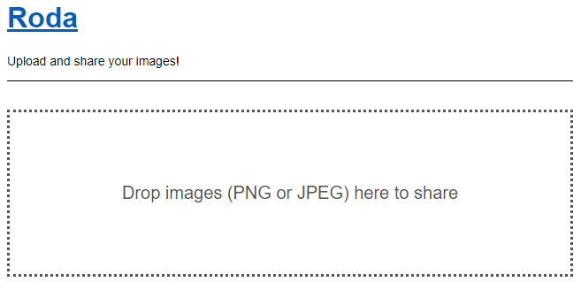
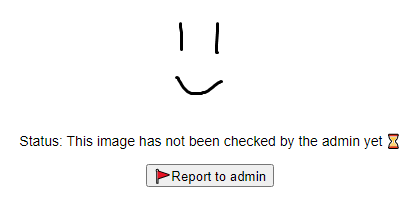

(English version: [https://hackmd.io/@st98/By9ZkjNDK](https://hackmd.io/@st98/By9ZkjNDK))

11 月 6 日から 11 月 7 日にかけて、チーム zer0pts は [BSides Ahmedabad CTF 2021](https://ctftime.org/event/1466/) を開催しました。66 点以上得点したチームは 314 チームでした。ご参加ありがとうございました。

1 位は 4032 点を獲得した ./Vespiary、2 位は 3685 点を獲得した Black Bauhinia、3 位は 2902 点を獲得した Thehackerscrew でした。おめでとうございます🎉

競技時間中に解かれなかった [s1r1us](https://twitter.com/S1r1u5_) さん作問の neutron, bettercatalog の 2 問については、それぞれ最初に解いた方に 50 ドルの賞金が与えられるそうなのでぜひ挑んでみてください。

<blockquote class="twitter-tweet"><p lang="en" dir="ltr">The CTF is over, Neutron(ElectronJS) and bettercatalog(1day XS-leak) are still unsolved.<br><br>So, we are extending challenges for a week. Get the first blood and submit the writeup, and you will get a chance to win $50/each. <br><br>More details about the challenges:<a href="https://t.co/m5cSwA8EQS">https://t.co/m5cSwA8EQS</a> <a href="https://t.co/nNLe3veITB">https://t.co/nNLe3veITB</a> <a href="https://t.co/WcK8tes8P9">pic.twitter.com/WcK8tes8P9</a></p>&mdash; s1r1us (@S1r1u5_) <a href="https://twitter.com/S1r1u5_/status/1457193204655157251?ref_src=twsrc%5Etfw">November 7, 2021</a></blockquote> <script async src="https://platform.twitter.com/widgets.js" charset="utf-8"></script>

この記事では、出題された 23 問のうち私が作問した以下の 1 問について解説します。

- [[Web 200] Roda (21 solves)](#web-200-roda-21-solves)

## [Web 200] Roda (21 solves)
> I made an image uploader. It is easy to use; just drag and drop, and share the URL with your friends!
> 
> If you find a suspicious image, please report it to the admin. The admin will check it.
> 
> (URL)
> 
> 添付ファイル: [roda_1fcc5923ea213c01886ae2d67a509689.tar.gz](../files/20211107-bsides-ahmedabad-ctf-2021/roda_1fcc5923ea213c01886ae2d67a509689.tar.gz)

### 問題の概要
画像をドラッグ&ドロップでアップロードできる Web アプリケーションが与えられています。でかでかと書かれているメッセージから、JPEG もしくは PNG のアップロードしか受け付けていないらしいことがわかります。



画像をアップロードすると、`/WfteW6oJ` のようなランダムに生成された URL に遷移します。これは画像に割り当てられたパーマリンクです。

このページでは `` タグで `/uploads/(UUID).(jpg|png)` にアップロードされた画像が埋め込まれており、ページ下部には admin に報告できるボタンがあります。このボタンを押すと、admin が Google Chrome でこのページを見に来ます。



フラグの場所を確認しましょう。与えられているソースコードを確認すると、Cookie の `secret` というキーに入っている値が特定の文字列 (`SECRET` という環境変数に入っている文字列) であれば、`/flag` にアクセスすると表示されるらしいことがわかります。その「特定の文字列」は推測できないものなので、実質的には admin しかフラグを見られないということになります。

```javascript
const SECRET = process.env.SECRET || 's3cr3t';
const FLAG = process.env.FLAG || 'Neko{dummy}';

// ...

// admin only!
function adminRequired(req, res, next) {
  if (!('secret' in req.cookies)) {
    res.status(401).render('error', {
      message: 'Unauthorized'
    });
    return;
  }

  if (req.cookies.secret !== SECRET) {
    res.status(401).render('error', {
      message: 'Unauthorized'
    });
    return;
  }

  next();
}

// ...

app.get('/flag', adminRequired, (req, res) => {
  res.send(FLAG);
});
```

### ファイルのチェックをバイパスする
ファイルのアップロード処理を確認し、どのようにして JPEG と PNG だけをアップロードできるようにしているか把握しましょう。

`/upload` のハンドラを見てみると、まずアップロードされたファイルの内容と、オリジナルのファイル名から拡張子とを取り出していることがわかります。その後 `isValidFile` という関数にファイルの内容と拡張子を渡し、その返り値によってアップロードされたファイルをそのまま保管するかどうかを決めています。

```javascript
const upload = multer({
  storage,
  limits: {
    files: 1,
    fileSize: 100 * 1024
  }
});
app.post('/upload', upload.single('file'), (req, res) => {
  const { file } = req;
  fs.readFile(file.path, (err, data) => {
    const buf = new Uint8Array(data);

    const fileName = file.originalname;
    const ext = fileName.split('.').slice(-1)[0];
  
    // check if the file is safe
    if (isValidFile(ext, buf)) {
      const newFileName = uuidv4() + '.' + ext;
      fs.writeFile('uploads/' + newFileName, buf, (err, data) => {
        let id;
        do {
          id = generateId();
        } while (id in uploadedFiles);

        uploadedFiles[id] = newFileName;
        res.json({
          status: 'success',
          id
        });
      });
    } else {
      res.json({
        status: 'error',
        message: 'Invalid file'
      });
    }
  });
});
```

`isValidFile` は以下のような実装になっています。与えられた拡張子に応じて `SIGNATURES` で定義されたシグネチャを取り出し、ファイルの内容がそのシグネチャから始まっているかを確認しています。

ファイルの内容が `Uint8Array` であるためか、シグネチャとファイルの内容の比較は `compareUint8Arrays` という独自の関数で行われています。それぞれの長さが一致しているか確認した後に、1 バイトずつ比較しています。

実はこのチェックには問題があります。`SIGNATURES` が `Map` でなく `Object` であるために、もし拡張子が `toString` や `valueOf` といった `Object` に存在するメソッド名であれば、`signature` にはそれに対応する関数が入ります。

関数は引数の数を返す [`length` プロパティ](https://developer.mozilla.org/ja/docs/Web/JavaScript/Reference/Global_Objects/Function/length)を持つので、もし拡張子が `valueOf` であれば `signature.length` は 0 になります。これによって `compareUint8Arrays` では `known.length !== input.length` はいずれも 0 になるために常に `false` になりますし、その後のループもスキップされます。したがって、その返り値は常に `true` になります。

つまり、`valueOf` のような拡張子にすれば JPEG か PNG でないファイルもアップロードできます。

```javascript
const SIGNATURES = {
  'png': new Uint8Array([0x89, 0x50, 0x4e, 0x47, 0x0d, 0x0a, 0x1a, 0x0a]),
  'jpg': new Uint8Array([0xff, 0xd8])
};

function compareUint8Arrays(known, input) {
  if (known.length !== input.length) {
    return false;
  }

  for (let i = 0; i < known.length; i++) {
    if (known[i] !== input[i]) {
      return false;
    }
  }

  return true;
}

function isValidFile(ext, data) {
  // extension should not have special chars
  if (/[^0-9A-Za-z]/.test(ext)) {
    return false;
  }

  // prevent uploading files other than images
  if (!(ext in SIGNATURES)) {
    return false;
  }

  const signature = SIGNATURES[ext];
  return compareUint8Arrays(signature, data.slice(0, signature.length));
}
```

### XSS に持ち込みたい
JPEG や PNG 以外のファイルもアップロードできることがわかりましたが、これは悪用できるようなことなのでしょうか。ソースコードを確認しつつ考えていきましょう。

アップロード後のファイルがどのように扱われるか確認します。以下に抜粋した箇所は、リクエストされたパスに対応するファイルの内容を返す処理にあたります。まず `..` や `/` のような危険な文字列がパスに含まれているか、あるいはリクエストされたファイルが存在していなければ、HTML でエラーを表示します。どちらにも当てはまらなければ、ファイルの拡張子に対応する `Content-Type` ヘッダを設定した上で、ファイルの内容を返します。

もし `valueOf` のような拡張子であればどうなるのでしょうか。`MIME_TYPES` は `SIGNATURES` と同様に `Object` なので、`MIMES_TYPES[ext]` は関数を返します。`res.type` は引数が関数である場合には[対応していない](https://github.com/expressjs/express/blob/f9a0560a9cb5ee2fcb901a6ed3710e9ffb6aa55c/lib/response.js#L594)ためにエラーが発生し、`res.type(MIME_TYPES[ext]);` は失敗します。これより前に `res.type('text/html');` が実行されているために、`Content-Type` は `text/html` に設定されます。

つまり、拡張子を `valueOf` などにすれば、それが HTML として表示されるということになります。XSS チャンス!

```javascript
// show uploaded contents
const MIME_TYPES = {
  'png': 'image/png',
  'jpg': 'image/jpeg'
};

app.get('/uploads/:fileName', (req, res) => {
  const { fileName } = req.params;
  const path = 'uploads/' + fileName;

  // no path traversal
  res.type('text/html'); // prepare for error messages
  if (/[/\\]|\.\./.test(fileName)) {
    res.status(403).render('error', {
      message: 'No hack'
    });
    return;
  }

  // check if the file exists
  try {
    fs.accessSync(path);
  } catch (e) {
    res.status(404).render('error', {
      message: 'Not found'
    });
    return;
  }

  // send proper Content-Type header
  try {
    const ext = fileName.split('.').slice(-1)[0];
    res.type(MIME_TYPES[ext]);
  } catch {}

  fs.readFile(path, (err, data) => {
    res.send(data);
  });
});
```

試しに以下のような内容のファイルを `test.valueOf` というファイル名でアップロードします。`/uploads/(UUID).valueOf` にアクセスするとアラートが表示されました。あとは `/flag` の内容を取得するようなスクリプトに変えて、admin に踏ませるだけです。

```html
<script>
alert(123);
</script>
```

### admin への報告
あとは admin に URL を報告するだけと思いきや、以下のコードを見るとわかるように報告できる URL は制限されていることがわかります。`/uploads/(UUID).valueOf/report` に POST するだけでは、パスが `/:id/report` にマッチしないらしく 404 が返ってきてしまいます。

実は `/` にパーセントエンコーディングを施せばバイパスできます。`/uploads%2f(UUID).valueOf/report` に POST すればパスは `/:id/report` にマッチし、`req.params.id` には `uploads/(UUID).valueOf` が入ります。

```javascript
// report image to admin
app.post('/:id/report', async (req, res) => {
  const { id } = req.params;
  const { token } = req.query;
/*
  const params = `?secret=${RECAPTCHA_SECRET_KEY}&response=${encodeURIComponent(token)}`;
  const url = 'https://www.google.com/recaptcha/api/siteverify' + params;
  const result = await axios.get(url);

  if (!result.data.success) {
    res.json({
      status: 'error',
      message: 'reCAPTCHA failed'
    });
    return;
  }
*/
  redis.rpush('query', id);
  redis.llen('query', (err, result) => {
    console.log('[+] reported:', id);
    console.log('[+] length:', result);
    res.json({
      status: 'success',
      length: result
    });
  })
})
```

以下のスクリプトを適当な画像表示ページで実行し、報告ボタンが押されたときに実行される処理を置き換えます。このまま報告ボタンを押すと、admin によって指定した URL にフラグが POST されました。

```javascript
async function onSubmit(token) {
  const button = document.getElementById('recaptcha');
  button.disabled = true;

  const result = await (await fetch('/uploads%2f(UUID).valueOf/report?token=' + token, {
    method: 'POST'
  })).json();
  button.textContent = '\u{1f6a9}Thanks for the report! Queue length: ' + result.length;
  button.disabled = true;
}
```

```
Neko{S4EoMHlo608?t=2m30s}
```

---

画像のアップローダなので「ろだ」です。フラグは YouTube の[動画 ID と再生位置](https://youtu.be/S4EoMHlo608?t=2m30s)です。問題の内容との関連はまったくありませんが。いい感じのフラグが思いつかなかったので、ちょうどその時バックグラウンドで再生していた動画の URL から持ってきました。かわいいなあ。

関数オブジェクトにも `length` プロパティが生えているという話は [TSG Live! CTF 6 の問題で既出](https://github.com/tsg-ut/tsg-live-ctf-6/tree/44eec9efa0715efc744df1ffd67346debe1ff944/web/truth-about-pi)ですし、ほかの細々としたネタもググるなり色々試すなりしていれば、そのうち見つかって解けるんじゃないかなと思いながら作りました。